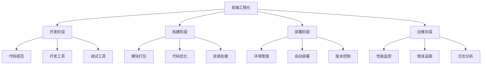

# 第1章：前端工程化概述与环境搭建

## 本章目标

- 理解前端工程化的核心概念和价值
- 了解现代前端开发面临的挑战
- 掌握开发环境的搭建与配置
- 学会选择合适的工具链

## 1.1 前端工程化的定义与价值

### 什么是前端工程化？

前端工程化是指通过工具、流程、规范和最佳实践来提高前端开发效率、代码质量和项目可维护性的系统性方法。

### 核心价值

#### 1. 提高开发效率
```bash
# 传统开发方式
手动刷新浏览器 → 手动压缩代码 → 手动上传文件

# 工程化开发方式
自动热重载 → 自动构建优化 → 自动化部署
```

#### 2. 保证代码质量
```javascript
// 没有工程化：代码风格不统一
function getData(){
    return fetch('/api/data').then(res=>res.json())
}

// 有工程化：统一的代码风格和类型检查
async function getData(): Promise<ApiResponse> {
  try {
    const response = await fetch('/api/data');
    return await response.json();
  } catch (error) {
    console.error('Failed to fetch data:', error);
    throw error;
  }
}
```

#### 3. 提升团队协作
- 统一的代码规范和格式化
- 标准化的项目结构
- 自动化的代码检查和测试

#### 4. 优化用户体验
- 代码分割和懒加载
- 资源压缩和优化
- 缓存策略和CDN

## 1.2 现代前端开发面临的挑战

### 复杂性挑战

#### 1. 技术栈复杂
```
前端技术栈示例：
├── 框架：React/Vue/Angular
├── 语言：TypeScript/JavaScript
├── 构建：Webpack/Vite/Rollup
├── 样式：Sass/Less/PostCSS
├── 测试：Jest/Cypress/Playwright
├── 部署：Docker/K8s/Serverless
└── 监控：Sentry/LogRocket
```

#### 2. 项目规模增长
```
小型项目 → 中型项目 → 大型项目
10个文件 → 100个文件 → 1000+个文件
1个开发者 → 5个开发者 → 50+个开发者
```

#### 3. 性能要求提升
- 首屏加载时间 < 3秒
- 交互响应时间 < 100ms
- 移动端适配和优化

### 解决方案：工程化体系



## 1.3 开发环境搭建

### Node.js环境配置

#### 1. 安装Node.js
```bash
# 使用nvm管理Node.js版本（推荐）
# Windows
curl -o- https://raw.githubusercontent.com/coreybutler/nvm-windows/master/install.cmd | cmd

# macOS/Linux
curl -o- https://raw.githubusercontent.com/nvm-sh/nvm/v0.39.0/install.sh | bash

# 安装最新LTS版本
nvm install --lts
nvm use --lts

# 验证安装
node --version
npm --version
```

#### 2. npm配置优化
```bash
# 设置npm镜像源
npm config set registry https://registry.npmmirror.com

# 设置npm缓存目录
npm config set cache "D:\npm-cache"

# 设置npm全局安装目录
npm config set prefix "D:\npm-global"

# 查看配置
npm config list
```

### 包管理器选择

#### npm vs yarn vs pnpm 对比

| 特性 | npm | yarn | pnpm |
|------|-----|------|------|
| 安装速度 | 中等 | 快 | 最快 |
| 磁盘占用 | 大 | 大 | 小 |
| 锁文件 | package-lock.json | yarn.lock | pnpm-lock.yaml |
| Monorepo支持 | 基础 | 好 | 最好 |

#### pnpm安装和配置（推荐）
```bash
# 安装pnpm
npm install -g pnpm

# 设置镜像源
pnpm config set registry https://registry.npmmirror.com

# 验证安装
pnpm --version
```

### 编辑器配置

#### VS Code推荐插件
```json
// .vscode/extensions.json
{
  "recommendations": [
    "esbenp.prettier-vscode",
    "dbaeumer.vscode-eslint",
    "bradlc.vscode-tailwindcss",
    "ms-vscode.vscode-typescript-next",
    "usernamehw.errorlens",
    "christian-kohler.path-intellisense",
    "formulahendry.auto-rename-tag",
    "ms-vscode.vscode-json"
  ]
}
```

#### VS Code工作区配置
```json
// .vscode/settings.json
{
  "editor.formatOnSave": true,
  "editor.defaultFormatter": "esbenp.prettier-vscode",
  "editor.codeActionsOnSave": {
    "source.fixAll.eslint": true
  },
  "typescript.preferences.importModuleSpecifier": "relative",
  "emmet.includeLanguages": {
    "javascript": "javascriptreact",
    "typescript": "typescriptreact"
  }
}
```

## 1.4 工具链选择指南

### 构建工具选择

#### 1. Vite（推荐新项目）
```javascript
// vite.config.js
import { defineConfig } from 'vite'
import react from '@vitejs/plugin-react'

export default defineConfig({
  plugins: [react()],
  server: {
    port: 3000,
    open: true
  },
  build: {
    outDir: 'dist',
    sourcemap: true
  }
})
```

**优势：**
- 极快的冷启动
- 即时的热模块替换
- 开箱即用的TypeScript支持

#### 2. Webpack（成熟项目）
```javascript
// webpack.config.js
const path = require('path');

module.exports = {
  entry: './src/index.js',
  output: {
    path: path.resolve(__dirname, 'dist'),
    filename: 'bundle.js'
  },
  module: {
    rules: [
      {
        test: /\.jsx?$/,
        exclude: /node_modules/,
        use: 'babel-loader'
      }
    ]
  }
};
```

**优势：**
- 生态系统成熟
- 配置灵活强大
- 社区支持完善

### 框架选择

#### React生态
```bash
# 创建React项目
npx create-react-app my-app --template typescript
# 或使用Vite
npm create vite@latest my-app -- --template react-ts
```

#### Vue生态
```bash
# 创建Vue项目
npm create vue@latest my-app
# 选择TypeScript、Router、Pinia等
```

### 开发工具链配置

#### 1. 基础项目结构
```
my-frontend-project/
├── src/
│   ├── components/     # 组件
│   ├── pages/         # 页面
│   ├── utils/         # 工具函数
│   ├── hooks/         # 自定义Hook
│   ├── styles/        # 样式文件
│   └── types/         # 类型定义
├── public/            # 静态资源
├── tests/             # 测试文件
├── docs/              # 文档
├── .vscode/           # VS Code配置
├── package.json
├── tsconfig.json
├── vite.config.ts
└── README.md
```

#### 2. package.json脚本配置
```json
{
  "scripts": {
    "dev": "vite",
    "build": "tsc && vite build",
    "preview": "vite preview",
    "lint": "eslint src --ext ts,tsx --report-unused-disable-directives --max-warnings 0",
    "lint:fix": "eslint src --ext ts,tsx --fix",
    "format": "prettier --write \"src/**/*.{ts,tsx,js,jsx,json,css,md}\"",
    "type-check": "tsc --noEmit",
    "test": "jest",
    "test:watch": "jest --watch",
    "test:coverage": "jest --coverage"
  }
}
```

## 1.5 环境验证

### 创建示例项目
```bash
# 创建项目目录
mkdir frontend-engineering-demo
cd frontend-engineering-demo

# 初始化项目
pnpm create vite . --template react-ts

# 安装依赖
pnpm install

# 启动开发服务器
pnpm dev
```

### 验证清单
- [ ] Node.js版本 >= 16
- [ ] 包管理器正常工作
- [ ] 编辑器插件安装完成
- [ ] 项目能够正常启动
- [ ] 热重载功能正常
- [ ] TypeScript类型检查正常

## 本章小结

本章我们学习了：

1. **前端工程化概念**：理解了工程化的定义、价值和必要性
2. **开发环境搭建**：配置了Node.js、包管理器和编辑器
3. **工具链选择**：了解了不同工具的特点和适用场景
4. **项目结构**：建立了标准化的项目组织方式

## 练习题

1. 比较npm、yarn、pnpm的优缺点，选择适合的包管理器
2. 配置VS Code开发环境，安装必要的插件
3. 创建一个基础的前端项目，验证开发环境
4. 研究不同构建工具的特点和使用场景

## 下一章预告

下一章我们将深入学习包管理与依赖管理，包括package.json详解、版本管理策略和私有包发布。

---

[返回目录](../) | [下一章：包管理与依赖管理](../chapter-02/)
