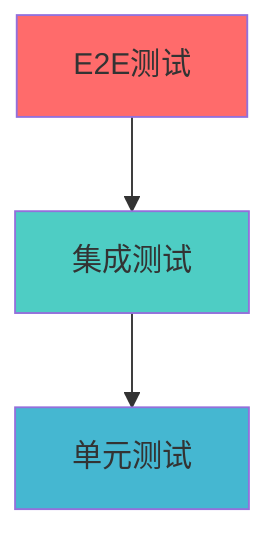

# 第5章：自动化测试体系

## 本章目标

- 掌握Jest/Vitest单元测试框架
- 学会编写组件测试和集成测试
- 了解E2E测试的配置和实践
- 建立完整的测试覆盖率体系

## 5.1 测试金字塔理论

### 测试分层架构



#### 测试类型对比

| 测试类型 | 数量占比 | 执行速度 | 维护成本 | 反馈价值 |
|---------|---------|---------|---------|---------|
| 单元测试 | 70% | 快 | 低 | 高 |
| 集成测试 | 20% | 中等 | 中等 | 中等 |
| E2E测试 | 10% | 慢 | 高 | 高 |

## 5.2 Jest/Vitest单元测试

### Jest配置

#### 1. 基础配置
```javascript
// jest.config.js
module.exports = {
  // 测试环境
  testEnvironment: 'jsdom',
  
  // 文件匹配模式
  testMatch: [
    '<rootDir>/src/**/__tests__/**/*.{js,jsx,ts,tsx}',
    '<rootDir>/src/**/*.{test,spec}.{js,jsx,ts,tsx}'
  ],
  
  // 模块路径映射
  moduleNameMapping: {
    '^@/(.*)$': '<rootDir>/src/$1',
    '^@components/(.*)$': '<rootDir>/src/components/$1',
    '^@utils/(.*)$': '<rootDir>/src/utils/$1'
  },
  
  // 设置文件
  setupFilesAfterEnv: ['<rootDir>/src/setupTests.ts'],
  
  // 覆盖率配置
  collectCoverageFrom: [
    'src/**/*.{js,jsx,ts,tsx}',
    '!src/**/*.d.ts',
    '!src/index.tsx',
    '!src/reportWebVitals.ts'
  ],
  
  coverageThreshold: {
    global: {
      branches: 80,
      functions: 80,
      lines: 80,
      statements: 80
    }
  },
  
  // 转换配置
  transform: {
    '^.+\\.(js|jsx|ts|tsx)$': 'babel-jest',
    '^.+\\.css$': 'jest-transform-css'
  },
  
  // 模块文件扩展名
  moduleFileExtensions: ['js', 'jsx', 'ts', 'tsx', 'json'],
  
  // 忽略转换的模块
  transformIgnorePatterns: [
    'node_modules/(?!(axios|@testing-library)/)'
  ]
};
```

#### 2. 测试环境设置
```typescript
// src/setupTests.ts
import '@testing-library/jest-dom';
import { configure } from '@testing-library/react';

// 配置Testing Library
configure({
  testIdAttribute: 'data-testid',
});

// 全局模拟
global.matchMedia = global.matchMedia || function (query) {
  return {
    matches: false,
    media: query,
    onchange: null,
    addListener: jest.fn(),
    removeListener: jest.fn(),
    addEventListener: jest.fn(),
    removeEventListener: jest.fn(),
    dispatchEvent: jest.fn(),
  };
};

// 模拟IntersectionObserver
global.IntersectionObserver = class IntersectionObserver {
  constructor() {}
  observe() { return null; }
  disconnect() { return null; }
  unobserve() { return null; }
};

// 模拟ResizeObserver
global.ResizeObserver = class ResizeObserver {
  constructor() {}
  observe() { return null; }
  disconnect() { return null; }
  unobserve() { return null; }
};
```

### Vitest配置（推荐）

#### 1. 基础配置
```typescript
// vitest.config.ts
import { defineConfig } from 'vitest/config';
import react from '@vitejs/plugin-react';
import { resolve } from 'path';

export default defineConfig({
  plugins: [react()],
  
  test: {
    environment: 'jsdom',
    setupFiles: ['./src/setupTests.ts'],
    
    // 全局配置
    globals: true,
    
    // 覆盖率配置
    coverage: {
      provider: 'v8',
      reporter: ['text', 'json', 'html'],
      exclude: [
        'node_modules/',
        'src/setupTests.ts',
        'src/**/*.d.ts',
        'src/**/*.config.{js,ts}',
        'src/**/*.stories.{js,ts,jsx,tsx}'
      ],
      thresholds: {
        global: {
          branches: 80,
          functions: 80,
          lines: 80,
          statements: 80
        }
      }
    },
    
    // 并发配置
    threads: true,
    maxThreads: 4,
    minThreads: 1
  },
  
  resolve: {
    alias: {
      '@': resolve(__dirname, './src'),
      '@components': resolve(__dirname, './src/components'),
      '@utils': resolve(__dirname, './src/utils')
    }
  }
});
```

### 单元测试实践

#### 1. 工具函数测试
```typescript
// src/utils/format.ts
export function formatCurrency(amount: number, currency = 'USD'): string {
  return new Intl.NumberFormat('en-US', {
    style: 'currency',
    currency
  }).format(amount);
}

export function formatDate(date: Date | string, format = 'YYYY-MM-DD'): string {
  const d = new Date(date);
  
  if (isNaN(d.getTime())) {
    throw new Error('Invalid date');
  }
  
  const year = d.getFullYear();
  const month = String(d.getMonth() + 1).padStart(2, '0');
  const day = String(d.getDate()).padStart(2, '0');
  
  return format
    .replace('YYYY', String(year))
    .replace('MM', month)
    .replace('DD', day);
}
```

```typescript
// src/utils/__tests__/format.test.ts
import { formatCurrency, formatDate } from '../format';

describe('formatCurrency', () => {
  it('should format USD currency correctly', () => {
    expect(formatCurrency(1234.56)).toBe('$1,234.56');
  });
  
  it('should format different currencies', () => {
    expect(formatCurrency(1234.56, 'EUR')).toBe('€1,234.56');
    expect(formatCurrency(1234.56, 'JPY')).toBe('¥1,235');
  });
  
  it('should handle zero amount', () => {
    expect(formatCurrency(0)).toBe('$0.00');
  });
  
  it('should handle negative amounts', () => {
    expect(formatCurrency(-1234.56)).toBe('-$1,234.56');
  });
});

describe('formatDate', () => {
  it('should format date correctly', () => {
    const date = new Date('2023-12-25');
    expect(formatDate(date)).toBe('2023-12-25');
  });
  
  it('should handle string dates', () => {
    expect(formatDate('2023-12-25')).toBe('2023-12-25');
  });
  
  it('should throw error for invalid dates', () => {
    expect(() => formatDate('invalid-date')).toThrow('Invalid date');
  });
  
  it('should handle custom formats', () => {
    const date = new Date('2023-12-25');
    expect(formatDate(date, 'DD/MM/YYYY')).toBe('25/12/2023');
  });
});
```

#### 2. React组件测试
```typescript
// src/components/Button/Button.tsx
import React from 'react';
import { cn } from '@/utils/cn';

interface ButtonProps {
  children: React.ReactNode;
  variant?: 'primary' | 'secondary' | 'danger';
  size?: 'small' | 'medium' | 'large';
  disabled?: boolean;
  loading?: boolean;
  onClick?: () => void;
  'data-testid'?: string;
}

export const Button: React.FC<ButtonProps> = ({
  children,
  variant = 'primary',
  size = 'medium',
  disabled = false,
  loading = false,
  onClick,
  'data-testid': testId,
  ...props
}) => {
  const baseClasses = 'inline-flex items-center justify-center rounded-md font-medium transition-colors';
  
  const variantClasses = {
    primary: 'bg-blue-600 text-white hover:bg-blue-700',
    secondary: 'bg-gray-200 text-gray-900 hover:bg-gray-300',
    danger: 'bg-red-600 text-white hover:bg-red-700'
  };
  
  const sizeClasses = {
    small: 'px-3 py-1.5 text-sm',
    medium: 'px-4 py-2 text-base',
    large: 'px-6 py-3 text-lg'
  };
  
  return (
    <button
      className={cn(
        baseClasses,
        variantClasses[variant],
        sizeClasses[size],
        (disabled || loading) && 'opacity-50 cursor-not-allowed'
      )}
      disabled={disabled || loading}
      onClick={onClick}
      data-testid={testId}
      {...props}
    >
      {loading && <span className="mr-2">Loading...</span>}
      {children}
    </button>
  );
};
```

```typescript
// src/components/Button/__tests__/Button.test.tsx
import React from 'react';
import { render, screen, fireEvent } from '@testing-library/react';
import { Button } from '../Button';

describe('Button', () => {
  it('renders children correctly', () => {
    render(<Button>Click me</Button>);
    expect(screen.getByRole('button', { name: 'Click me' })).toBeInTheDocument();
  });
  
  it('applies correct variant classes', () => {
    const { rerender } = render(<Button variant="primary">Primary</Button>);
    expect(screen.getByRole('button')).toHaveClass('bg-blue-600');
    
    rerender(<Button variant="secondary">Secondary</Button>);
    expect(screen.getByRole('button')).toHaveClass('bg-gray-200');
    
    rerender(<Button variant="danger">Danger</Button>);
    expect(screen.getByRole('button')).toHaveClass('bg-red-600');
  });
  
  it('applies correct size classes', () => {
    const { rerender } = render(<Button size="small">Small</Button>);
    expect(screen.getByRole('button')).toHaveClass('px-3 py-1.5 text-sm');
    
    rerender(<Button size="medium">Medium</Button>);
    expect(screen.getByRole('button')).toHaveClass('px-4 py-2 text-base');
    
    rerender(<Button size="large">Large</Button>);
    expect(screen.getByRole('button')).toHaveClass('px-6 py-3 text-lg');
  });
  
  it('handles click events', () => {
    const handleClick = jest.fn();
    render(<Button onClick={handleClick}>Click me</Button>);
    
    fireEvent.click(screen.getByRole('button'));
    expect(handleClick).toHaveBeenCalledTimes(1);
  });
  
  it('disables button when disabled prop is true', () => {
    render(<Button disabled>Disabled</Button>);
    const button = screen.getByRole('button');
    
    expect(button).toBeDisabled();
    expect(button).toHaveClass('opacity-50 cursor-not-allowed');
  });
  
  it('shows loading state', () => {
    render(<Button loading>Loading</Button>);
    const button = screen.getByRole('button');
    
    expect(button).toBeDisabled();
    expect(button).toHaveClass('opacity-50 cursor-not-allowed');
    expect(screen.getByText('Loading...')).toBeInTheDocument();
  });
  
  it('does not call onClick when disabled', () => {
    const handleClick = jest.fn();
    render(<Button disabled onClick={handleClick}>Disabled</Button>);
    
    fireEvent.click(screen.getByRole('button'));
    expect(handleClick).not.toHaveBeenCalled();
  });
});
```

## 5.3 集成测试

### API集成测试

#### 1. Mock Service Worker配置
```typescript
// src/mocks/handlers.ts
import { rest } from 'msw';

export const handlers = [
  // 用户相关API
  rest.get('/api/users', (req, res, ctx) => {
    return res(
      ctx.json({
        code: 200,
        data: [
          { id: 1, name: 'John Doe', email: 'john@example.com' },
          { id: 2, name: 'Jane Smith', email: 'jane@example.com' }
        ]
      })
    );
  }),
  
  rest.post('/api/users', (req, res, ctx) => {
    return res(
      ctx.json({
        code: 201,
        data: { id: 3, name: 'New User', email: 'new@example.com' }
      })
    );
  }),
  
  rest.get('/api/users/:id', (req, res, ctx) => {
    const { id } = req.params;
    return res(
      ctx.json({
        code: 200,
        data: { id: Number(id), name: 'User Name', email: 'user@example.com' }
      })
    );
  })
];
```

```typescript
// src/mocks/server.ts
import { setupServer } from 'msw/node';
import { handlers } from './handlers';

export const server = setupServer(...handlers);
```

#### 2. 集成测试示例
```typescript
// src/hooks/__tests__/useUsers.test.ts
import { renderHook, waitFor } from '@testing-library/react';
import { QueryClient, QueryClientProvider } from '@tanstack/react-query';
import { useUsers } from '../useUsers';
import { server } from '@/mocks/server';

// 测试包装器
const createWrapper = () => {
  const queryClient = new QueryClient({
    defaultOptions: {
      queries: { retry: false },
      mutations: { retry: false }
    }
  });
  
  return ({ children }: { children: React.ReactNode }) => (
    <QueryClientProvider client={queryClient}>
      {children}
    </QueryClientProvider>
  );
};

describe('useUsers', () => {
  beforeAll(() => server.listen());
  afterEach(() => server.resetHandlers());
  afterAll(() => server.close());
  
  it('should fetch users successfully', async () => {
    const { result } = renderHook(() => useUsers(), {
      wrapper: createWrapper()
    });
    
    expect(result.current.isLoading).toBe(true);
    
    await waitFor(() => {
      expect(result.current.isSuccess).toBe(true);
    });
    
    expect(result.current.data).toHaveLength(2);
    expect(result.current.data[0]).toEqual({
      id: 1,
      name: 'John Doe',
      email: 'john@example.com'
    });
  });
  
  it('should handle error states', async () => {
    // 模拟API错误
    server.use(
      rest.get('/api/users', (req, res, ctx) => {
        return res(ctx.status(500), ctx.json({ error: 'Server Error' }));
      })
    );
    
    const { result } = renderHook(() => useUsers(), {
      wrapper: createWrapper()
    });
    
    await waitFor(() => {
      expect(result.current.isError).toBe(true);
    });
    
    expect(result.current.error).toBeDefined();
  });
});
```

## 5.4 E2E测试

### Playwright配置

#### 1. 安装和配置
```bash
# 安装Playwright
npm install --save-dev @playwright/test

# 初始化配置
npx playwright install
```

```typescript
// playwright.config.ts
import { defineConfig, devices } from '@playwright/test';

export default defineConfig({
  testDir: './e2e',
  
  // 全局设置
  fullyParallel: true,
  forbidOnly: !!process.env.CI,
  retries: process.env.CI ? 2 : 0,
  workers: process.env.CI ? 1 : undefined,
  
  // 报告配置
  reporter: [
    ['html'],
    ['json', { outputFile: 'test-results/results.json' }]
  ],
  
  use: {
    baseURL: 'http://localhost:3000',
    trace: 'on-first-retry',
    screenshot: 'only-on-failure',
    video: 'retain-on-failure'
  },
  
  // 项目配置
  projects: [
    {
      name: 'chromium',
      use: { ...devices['Desktop Chrome'] }
    },
    {
      name: 'firefox',
      use: { ...devices['Desktop Firefox'] }
    },
    {
      name: 'webkit',
      use: { ...devices['Desktop Safari'] }
    },
    {
      name: 'Mobile Chrome',
      use: { ...devices['Pixel 5'] }
    }
  ],
  
  // 开发服务器
  webServer: {
    command: 'npm run dev',
    url: 'http://localhost:3000',
    reuseExistingServer: !process.env.CI
  }
});
```

#### 2. E2E测试示例
```typescript
// e2e/user-management.spec.ts
import { test, expect } from '@playwright/test';

test.describe('User Management', () => {
  test.beforeEach(async ({ page }) => {
    await page.goto('/users');
  });
  
  test('should display user list', async ({ page }) => {
    // 等待用户列表加载
    await expect(page.locator('[data-testid="user-list"]')).toBeVisible();
    
    // 检查用户项
    const userItems = page.locator('[data-testid="user-item"]');
    await expect(userItems).toHaveCount(2);
    
    // 检查第一个用户
    const firstUser = userItems.first();
    await expect(firstUser.locator('[data-testid="user-name"]')).toHaveText('John Doe');
    await expect(firstUser.locator('[data-testid="user-email"]')).toHaveText('john@example.com');
  });
  
  test('should create new user', async ({ page }) => {
    // 点击创建用户按钮
    await page.click('[data-testid="create-user-btn"]');
    
    // 填写表单
    await page.fill('[data-testid="user-name-input"]', 'New User');
    await page.fill('[data-testid="user-email-input"]', 'newuser@example.com');
    
    // 提交表单
    await page.click('[data-testid="submit-btn"]');
    
    // 验证成功消息
    await expect(page.locator('[data-testid="success-message"]')).toBeVisible();
    await expect(page.locator('[data-testid="success-message"]')).toHaveText('User created successfully');
    
    // 验证用户已添加到列表
    await expect(page.locator('[data-testid="user-item"]')).toHaveCount(3);
  });
  
  test('should edit user', async ({ page }) => {
    // 点击编辑按钮
    await page.click('[data-testid="user-item"]:first-child [data-testid="edit-btn"]');
    
    // 修改用户名
    await page.fill('[data-testid="user-name-input"]', 'Updated Name');
    
    // 保存更改
    await page.click('[data-testid="save-btn"]');
    
    // 验证更新
    await expect(page.locator('[data-testid="user-item"]:first-child [data-testid="user-name"]'))
      .toHaveText('Updated Name');
  });
  
  test('should delete user', async ({ page }) => {
    // 点击删除按钮
    await page.click('[data-testid="user-item"]:first-child [data-testid="delete-btn"]');
    
    // 确认删除
    await page.click('[data-testid="confirm-delete-btn"]');
    
    // 验证用户已删除
    await expect(page.locator('[data-testid="user-item"]')).toHaveCount(1);
  });
  
  test('should handle form validation', async ({ page }) => {
    await page.click('[data-testid="create-user-btn"]');
    
    // 提交空表单
    await page.click('[data-testid="submit-btn"]');
    
    // 验证错误消息
    await expect(page.locator('[data-testid="name-error"]')).toHaveText('Name is required');
    await expect(page.locator('[data-testid="email-error"]')).toHaveText('Email is required');
    
    // 输入无效邮箱
    await page.fill('[data-testid="user-email-input"]', 'invalid-email');
    await page.click('[data-testid="submit-btn"]');
    
    await expect(page.locator('[data-testid="email-error"]')).toHaveText('Invalid email format');
  });
});
```

## 5.5 测试覆盖率与质量度量

### 覆盖率配置

#### 1. 详细覆盖率报告
```json
// package.json
{
  "scripts": {
    "test": "vitest",
    "test:coverage": "vitest run --coverage",
    "test:ui": "vitest --ui",
    "test:watch": "vitest --watch"
  }
}
```

#### 2. 覆盖率阈值配置
```typescript
// vitest.config.ts
export default defineConfig({
  test: {
    coverage: {
      thresholds: {
        global: {
          branches: 80,
          functions: 80,
          lines: 80,
          statements: 80
        },
        // 特定文件的阈值
        'src/utils/': {
          branches: 90,
          functions: 90,
          lines: 90,
          statements: 90
        }
      }
    }
  }
});
```

### 测试质量度量

#### 1. 测试报告生成
```bash
# 生成测试报告
npm run test:coverage

# 生成HTML报告
npm run test:coverage -- --reporter=html

# 生成多种格式报告
npm run test:coverage -- --reporter=text --reporter=json --reporter=html
```

#### 2. CI/CD集成
```yaml
# .github/workflows/test.yml
name: Test

on: [push, pull_request]

jobs:
  test:
    runs-on: ubuntu-latest
    
    steps:
      - uses: actions/checkout@v3
      
      - name: Setup Node.js
        uses: actions/setup-node@v3
        with:
          node-version: '18'
          cache: 'npm'
      
      - name: Install dependencies
        run: npm ci
      
      - name: Run unit tests
        run: npm run test:coverage
      
      - name: Run E2E tests
        run: npx playwright test
      
      - name: Upload coverage reports
        uses: codecov/codecov-action@v3
        with:
          file: ./coverage/lcov.info
      
      - name: Upload test results
        uses: actions/upload-artifact@v3
        if: always()
        with:
          name: test-results
          path: test-results/
```

## 本章小结

本章我们学习了：

1. **测试金字塔**：理解不同层次测试的作用和比例
2. **单元测试**：Jest/Vitest配置和组件测试实践
3. **集成测试**：API测试和Mock Service Worker使用
4. **E2E测试**：Playwright配置和端到端测试编写
5. **测试质量**：覆盖率配置和CI/CD集成

## 练习题

1. 为一个React组件编写完整的单元测试
2. 配置MSW进行API集成测试
3. 编写一个完整的E2E测试流程
4. 设置测试覆盖率阈值和质量门禁

## 下一章预告

下一章我们将学习性能优化与监控，包括构建性能优化、运行时性能优化和性能监控体系。

---

[上一章：代码质量保障](../chapter-04/README.md) | [返回目录](../README.md) | [下一章：性能优化与监控](../chapter-06/README.md)
