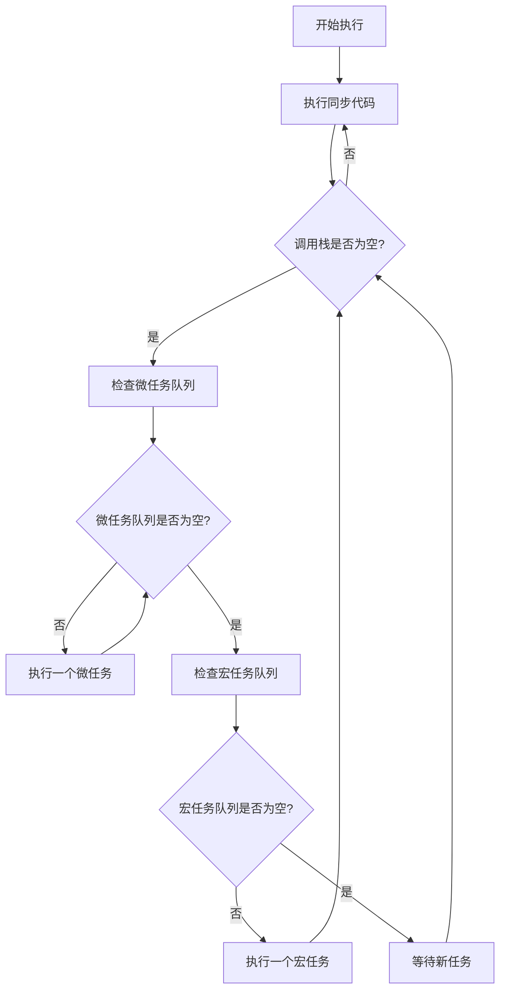

# 第1章：JavaScript引擎与执行机制

## 📖 本章概述

作为一名高级前端开发者，深入理解JavaScript引擎的工作原理是必不可少的。本章将带你探索JavaScript引擎的内部世界，从V8引擎架构到事件循环机制，帮助你建立对JavaScript执行过程的深度认知。

## 🎯 学习目标

完成本章学习后，你将能够：

- 理解V8引擎的架构和工作原理
- 掌握JavaScript事件循环的完整机制
- 深入了解调用栈和执行上下文
- 区分宏任务和微任务的执行顺序
- 理解内存管理和垃圾回收基础

## 🔧 V8引擎架构解析

### V8引擎概述

V8是Google开发的高性能JavaScript引擎，被广泛应用于Chrome浏览器和Node.js中。它的核心特点包括：

- **即时编译（JIT）**：将JavaScript代码直接编译为机器码
- **隐藏类优化**：通过隐藏类提高对象属性访问速度
- **内联缓存**：缓存属性访问和方法调用的结果
- **垃圾回收**：自动管理内存分配和释放

### V8编译流水线

```javascript
// JavaScript源码
function add(a, b) {
    return a + b;
}

// V8处理流程：
// 1. 词法分析 (Lexical Analysis)
// 2. 语法分析 (Syntax Analysis) 
// 3. 生成AST (Abstract Syntax Tree)
// 4. 生成字节码 (Bytecode)
// 5. 解释执行或编译为机器码
```

### 编译优化过程

V8使用多层编译策略：

1. **Ignition解释器**：快速生成字节码并执行
2. **TurboFan编译器**：对热点代码进行优化编译
3. **去优化机制**：当假设条件不成立时回退到解释执行

```javascript
// 示例：V8优化过程
function hotFunction(obj) {
    // 第一次调用：解释执行
    // 多次调用后：TurboFan优化
    // 如果obj类型改变：去优化
    return obj.x + obj.y;
}

// 优化友好的写法
const point1 = { x: 1, y: 2 };
const point2 = { x: 3, y: 4 };
hotFunction(point1); // 建立隐藏类
hotFunction(point2); // 复用隐藏类，性能更好
```

## ⚡ 事件循环深度剖析

### 事件循环基础概念

JavaScript是单线程语言，但通过事件循环机制实现了异步非阻塞的执行模式。

```javascript
// 事件循环示例
console.log('1'); // 同步任务

setTimeout(() => {
    console.log('2'); // 宏任务
}, 0);

Promise.resolve().then(() => {
    console.log('3'); // 微任务
});

console.log('4'); // 同步任务

// 输出顺序：1 -> 4 -> 3 -> 2
```

### 事件循环详细流程



### 宏任务与微任务

**宏任务（Macro Tasks）**：
- `setTimeout`
- `setInterval`
- `setImmediate` (Node.js)
- I/O操作
- UI渲染

**微任务（Micro Tasks）**：
- `Promise.then/catch/finally`
- `queueMicrotask`
- `MutationObserver`
- `process.nextTick` (Node.js)

```javascript
// 复杂的执行顺序示例
console.log('start');

setTimeout(() => console.log('timeout1'), 0);

Promise.resolve().then(() => {
    console.log('promise1');
    setTimeout(() => console.log('timeout2'), 0);
});

Promise.resolve().then(() => console.log('promise2'));

setTimeout(() => console.log('timeout3'), 0);

console.log('end');

// 输出：start -> end -> promise1 -> promise2 -> timeout1 -> timeout3 -> timeout2
```

## 📚 调用栈与执行上下文

### 调用栈机制

调用栈是JavaScript引擎跟踪函数调用的数据结构，遵循后进先出（LIFO）原则。

```javascript
function first() {
    console.log('first function');
    second();
    console.log('first function end');
}

function second() {
    console.log('second function');
    third();
    console.log('second function end');
}

function third() {
    console.log('third function');
    // 此时调用栈：[global, first, second, third]
}

first();
// 调用栈变化：
// [global] -> [global, first] -> [global, first, second] 
// -> [global, first, second, third] -> [global, first, second] 
// -> [global, first] -> [global]
```

### 执行上下文详解

每个函数调用都会创建一个执行上下文，包含：

1. **变量环境（Variable Environment）**
2. **词法环境（Lexical Environment）**
3. **this绑定**

```javascript
// 执行上下文示例
var globalVar = 'global';

function outerFunction(param) {
    var outerVar = 'outer';
    
    function innerFunction() {
        var innerVar = 'inner';
        console.log(globalVar); // 访问全局变量
        console.log(outerVar);  // 访问外层变量
        console.log(innerVar);  // 访问局部变量
        console.log(param);     // 访问参数
    }
    
    return innerFunction;
}

const closure = outerFunction('parameter');
closure();

// 执行上下文链：
// Global EC -> outerFunction EC -> innerFunction EC
```

### 作用域链与闭包

```javascript
// 闭包与作用域链示例
function createCounter() {
    let count = 0;
    
    return {
        increment() {
            count++;
            return count;
        },
        decrement() {
            count--;
            return count;
        },
        getCount() {
            return count;
        }
    };
}

const counter = createCounter();
console.log(counter.increment()); // 1
console.log(counter.increment()); // 2
console.log(counter.getCount());  // 2

// count变量被闭包保持，即使createCounter执行完毕
```

## 🧠 内存管理基础

### 内存分配

JavaScript中的内存分为两个主要区域：

1. **栈内存（Stack）**：存储基本类型和引用
2. **堆内存（Heap）**：存储对象和函数

```javascript
// 内存分配示例
let num = 42;           // 栈内存
let str = 'hello';      // 栈内存（小字符串）
let obj = { x: 1 };     // 堆内存，栈中存储引用

function example() {
    let localVar = 'local';  // 栈内存
    let localObj = {};       // 堆内存
    // 函数执行完毕后，localVar自动释放
    // localObj如果没有其他引用，会被垃圾回收
}
```

### 垃圾回收概述

V8使用分代垃圾回收策略：

- **新生代**：存储生命周期短的对象
- **老生代**：存储生命周期长的对象

```javascript
// 垃圾回收示例
function createObjects() {
    let temp = new Array(1000000).fill(0); // 大对象
    // 函数结束后，temp失去引用，等待垃圾回收
}

// 避免内存泄漏的最佳实践
let globalArray = [];

function addData(data) {
    globalArray.push(data);
    
    // 定期清理不需要的数据
    if (globalArray.length > 1000) {
        globalArray = globalArray.slice(-500);
    }
}
```

## 🔍 实践练习

### 练习1：事件循环理解

```javascript
// 预测输出顺序
async function async1() {
    console.log('async1 start');
    await async2();
    console.log('async1 end');
}

async function async2() {
    console.log('async2');
}

console.log('script start');

setTimeout(() => {
    console.log('setTimeout');
}, 0);

async1();

new Promise(resolve => {
    console.log('promise1');
    resolve();
}).then(() => {
    console.log('promise2');
});

console.log('script end');
```

### 练习2：性能优化

```javascript
// 优化前：频繁的对象创建
function inefficient() {
    for (let i = 0; i < 1000000; i++) {
        const obj = { x: i, y: i * 2 };
        // 处理obj...
    }
}

// 优化后：对象复用
function efficient() {
    const obj = { x: 0, y: 0 };
    for (let i = 0; i < 1000000; i++) {
        obj.x = i;
        obj.y = i * 2;
        // 处理obj...
    }
}
```

## 📝 本章小结

本章我们深入探讨了JavaScript引擎的核心机制：

1. **V8引擎**通过多层编译策略实现高性能执行
2. **事件循环**是JavaScript异步编程的基础
3. **调用栈**管理函数调用，**执行上下文**管理变量作用域
4. **内存管理**影响应用性能，需要注意避免内存泄漏

理解这些底层机制将帮助你：
- 编写更高效的代码
- 调试复杂的异步问题
- 优化应用性能
- 避免常见的内存问题

## 🚀 下一章预告

下一章我们将深入学习**高级异步编程**，包括Promise实现原理、async/await机制、Generator函数等高级异步编程技术。

---

**继续学习：[第2章：高级异步编程](../chapter-02/README.md)**
