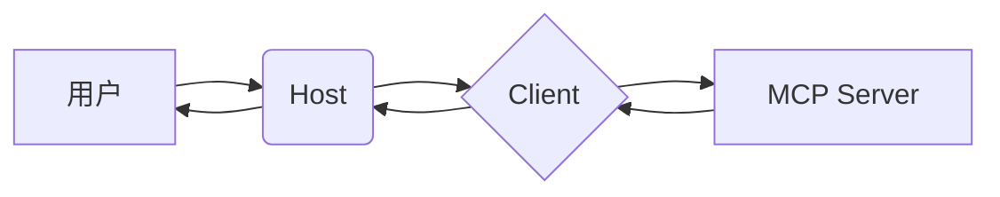

# MCP 协议基础概念与架构

## 什么是 MCP？

`MCP（Model Context Protocol，模型上下文协议）` 是一种开放协议，旨在实现大型语言模型（LLM）应用与外部数据源、工具和服务之间的无缝集成。它类似于网络中的 `HTTP` 协议或邮件中的 `SMTP` 协议，为 AI 应用生态系统提供统一的通信标准。

::: tip
简单来说，MCP 让大模型能够安全、可控地调用外部工具，从而突破纯文本生成的局限，具备执行实际任务的能力。
:::

## MCP 的核心价值

- **标准化集成**：通过统一接口连接 LLM 与各种服务（如数据库、API、文件系统等）
- **功能扩展**：赋予 LLM 实时数据访问、计算、搜索等能力
- **可组合性**：多个 MCP Server 可以像积木一样组合使用
- **安全性**：主机（Host）控制权限，确保用户始终在决策环路中

## MCP 架构的三大角色

### 1. 主机（Host）

主机是运行 AI 应用的容器，例如 VSCode 插件 Cline、聊天机器人等。它的职责包括：

- 管理客户端实例的生命周期
- 控制用户授权与安全策略
- 聚合来自多个服务器的上下文信息
- 协调 LLM 的采样与响应生成

> 示例：你在 VSCode 中使用的 Cline 插件就是一个典型的 Host。

### 2. 客户端（Client）

客户端是 Host 与 Server 之间的桥梁，每个客户端与一个 MCP Server 建立一对一的连接。其主要功能：

- 消息路由与协议协商
- 能力发现与订阅管理
- 维护会话状态

### 3. 服务器（Server）

服务器提供具体的上下文资源或工具能力，可以是一个本地 Node.js 进程或远程服务。它可以暴露：

- **Tools**：可调用的功能（如加法计算器、天气查询）
- **Resources**：可读取的数据源（如项目文件、数据库表结构）
- **Prompts**：预定义的提示模板

## MCP 的工作流程

1. Host 启动并创建 Client 实例
2. Client 连接到 MCP Server 并进行能力协商
3. 用户向 Host 提出请求（如“计算 5 + 3”）
4. Host 将请求转发给合适的 Client
5. Client 调用 Server 上对应的 Tool
6. Server 执行逻辑并返回结果
7. Host 接收结果并展示给用户

