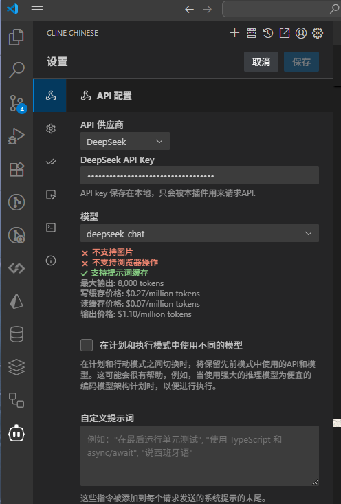
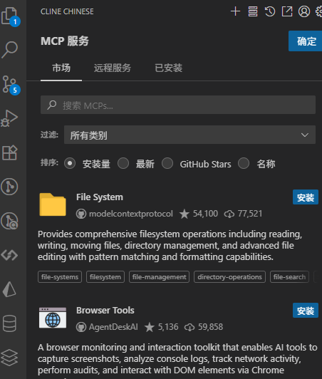
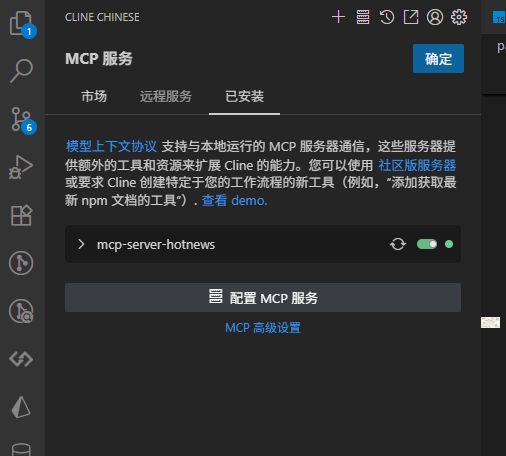
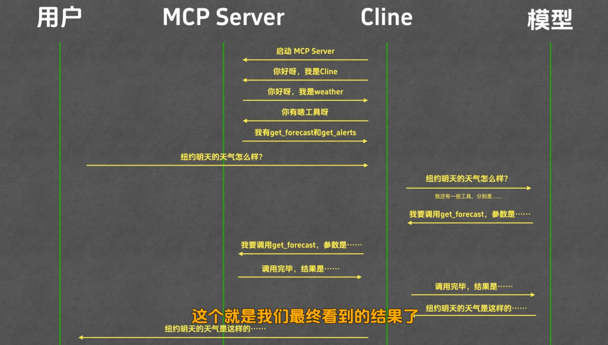
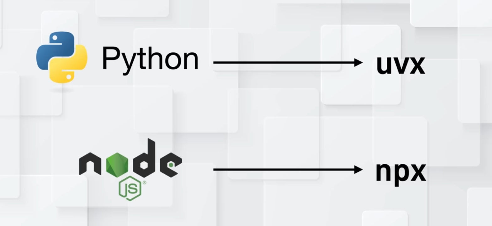

# MCP协议

`MCP（Model Context Protocol，模型上下文协议）`是一种开放协议，旨在实现 大型语言模型`（LLM）` 应用与外部数据源、工具和服务之间的无缝集成，类似于网络中的 `HTTP` 协议或邮件中的 `SMTP` 协议。
::: tip
简单来说就是让大模型使用各种工具，大模型只有问答的能力，通过 `MCP` 协议，可以调用各种工具，实现更多功能。
:::

`MCP` 协议通过标准化模型与外部资源的交互方式，提升 `LLM` 应用的功能性、灵活性和可扩展性。

`MCP` 通过标准化人工智能应用生态系统中的通信规则，为开发者提供了一个统一、高效且可互操作的开发环境。

## MCP 的核心概念
`MCP` 的核心是` 模型上下文`，即 `LLM` 在运行过程中所需的所有外部信息和工具。

`MCP` 通过定义标准化的接口和协议，使 `LLM` 能够动态访问和集成以下内容：

- **外部数据源**：如数据库、API、文档库等，为 LLM 提供实时或历史数据。
- **工具和服务**：如计算工具、搜索引擎、第三方服务等，扩展 LLM 的功能。
- **上下文管理**：动态维护 LLM 的对话上下文，确保连贯性和一致性。

## MCP 的架构
MCP 的架构由四个关键部分组成：

- **主机（Host）**：主机是期望从服务器获取数据的人工智能应用，例如一个集成开发环境（IDE）、聊天机器人等。主机负责初始化和管理客户端、处理用户授权、管理上下文聚合等。
- **客户端（Client）**：客户端是主机与服务器之间的桥梁。它与服务器保持一对一的连接，负责消息路由、能力管理、协议协商和订阅管理等。客户端确保主机和服务器之间的通信清晰、安全且高效。
- **服务器（Server）**：服务器是提供外部数据和工具的组件。它通过工具、资源和提示模板为大型语言模型提供额外的上下文和功能。例如，一个服务器可以提供与Gmail、Slack等外部服务的API调用。
- **基础协议（Base Protocol）**：基础协议定义了主机、客户端和服务器之间如何通信。它包括消息格式、生命周期管理和传输机制等。

***MCP 就像 USB-C 一样，可以让不同设备能够通过相同的接口连接在一起。***

## 实操
- 下载`vscode`插件`Cline`,`这就是MCP 的Host`
- 打开`Cline`,点击右上角的设置，配置自己的大模型和`api key`,点击确定
::: tip
Cline 支持多种大模型，我这里选择的是 `DeepseeK`
:::

- 在`MCP`面板，问今天天气怎么样，发现`Cline`会调用大模型，然后寻找天气相关的`MCP Server`，最后返回结果
- 如果没有天气相关的 `MCP Server`, 我们可以在市场寻找相关的MCP Server,安装即可

## 手动配置MCP Server

- 有时候需要手动配置`MCP Server`，比如`Cline`没有找到天气相关的`MCP Server`,我们可以手动配置一个`MCP Server`

## MCP的交互流程详解
::: tip
- MCP Cline 就是`Cline`
- MCP Server 就是`mcp插件市场的一个插件`，比如这里就是天气插件
- 模型 就是`大模型`，这是是Deepseek
- 用户 就是`我们`，比如这里就是问天气
:::
下面是询问天气后的，执行流程：

## MCP相关市场
::: tip
有些MCP是`node`写的，有的是`Python`写的，需要安装对应的运行环境
:::

- [mcpmarket](https://mcpmarket.com/zh)
- [mcp.so](https://mcp.so/)
- ...

> 引用[菜鸟MCP](https://www.runoob.com/np/mcp-protocol.html)、[MCP视频教程](https://www.youtube.com/watch?v=yjBUnbRgiNs)