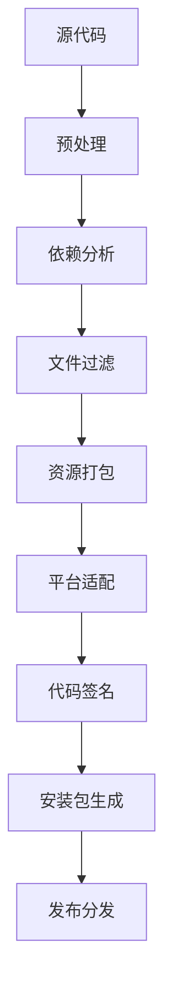

# Electron 应用打包与分发：从入门到精通

Electron 应用的打包和分发是开发流程中的关键环节。本文将深入探讨 Electron Builder 的配置优化、多平台打包策略、性能优化技巧以及自动化部署方案。

## 核心概念与架构

### Electron Builder vs Electron Packager

| 特性 | Electron Builder | Electron Packager |
|------|------------------|-------------------|
| 配置复杂度 | 高（功能丰富） | 低（简单直接） |
| 安装包格式 | 支持多种格式 | 仅基础打包 |
| 自动更新 | 内置支持 | 需要额外配置 |
| 代码签名 | 完整支持 | 基础支持 |
| 社区活跃度 | 高 | 中等 |

### 打包流程概览



## 基础配置详解

### 项目结构规范

```
my-electron-app/
├── src/                    # 源代码目录
│   ├── main/              # 主进程代码
│   ├── renderer/          # 渲染进程代码
│   └── preload/           # 预加载脚本
├── build/                 # 构建资源
│   ├── icons/             # 应用图标
│   ├── installers/        # 安装程序资源
│   └── certificates/      # 代码签名证书
├── dist/                  # 构建输出
├── out/                   # 编译输出
├── package.json           # 项目配置
└── electron-builder.yml   # 打包配置
```

### 核心配置文件

````yml
# electron-builder.yml - 生产级配置
appId: com.company.appname
productName: "应用名称"
copyright: "Copyright © 2024 ${author}"
description: "应用描述"

# 目录配置
directories:
  buildResources: build
  output: dist
  app: out

# 文件包含策略（性能优化关键）
files:
  - "out/**/*"
  - "node_modules/**/*"
  - "package.json"
  # 排除开发依赖和无用文件
  - "!**/node_modules/*/{CHANGELOG.md,README.md,readme.md}"
  - "!**/node_modules/*/{test,__tests__,tests,example,examples}"
  - "!**/node_modules/*.d.ts"
  - "!**/node_modules/.bin"
  - "!**/{.DS_Store,.git,.gitignore}"
  - "!**/{npm-debug.log,yarn.lock}"

# 性能优化配置
compression: maximum
removePackageScripts: true
removePackageKeywords: true
buildDependenciesFromSource: false
````

## 多平台配置策略

### Windows 平台优化

Windows 平台是 Electron 应用的主要目标平台，需要特别关注用户体验和安全性：

````yml
win:
  # 多格式支持策略
  target:
    - target: nsis          # 企业级安装程序
      arch: [x64, ia32]
    - target: portable      # 便携版（无需安装）
      arch: [x64]
    - target: appx          # Microsoft Store
      arch: [x64]

  icon: build/icon.ico      # 256x256 ICO格式
  requestedExecutionLevel: asInvoker  # 避免UAC提示

  # 文件关联配置
  fileAssociations:
    - ext: myext
      name: "My Document"
      description: "My application document"
      icon: build/fileicon.ico
      role: Editor

  # URL协议注册
  protocols:
    - name: "myapp-protocol"
      schemes: ["myapp"]
````

#### NSIS 安装程序高级配置

````yml
nsis:
  # 用户体验优化
  oneClick: false                    # 允许自定义安装
  allowElevation: true               # 智能权限提升
  allowToChangeInstallationDirectory: true

  # 快捷方式策略
  createDesktopShortcut: ask         # 询问用户
  createStartMenuShortcut: true
  shortcutName: "${productName}"

  # 安装后行为
  runAfterFinish: true
  deleteAppDataOnUninstall: false   # 保护用户数据

  # 多语言支持
  language: "2052"                   # 简体中文

  # 自定义安装界面
  installerIcon: build/installer.ico
  installerSidebar: build/sidebar.bmp
  installerHeader: build/header.bmp

  # 文件名规范
  artifactName: "${productName}-v${version}-${arch}-setup.${ext}"
````

### macOS 平台配置

macOS 平台需要特别注意代码签名和公证流程：

````yml
mac:
  # 多架构支持
  target:
    - target: dmg
      arch: [x64, arm64]    # Intel + Apple Silicon
    - target: zip
      arch: [x64, arm64]
    - target: pkg           # 企业分发
      arch: [universal]     # 通用二进制

  icon: build/icon.icns     # 1024x1024 ICNS格式
  category: public.app-category.productivity

  # 安全配置
  hardenedRuntime: true
  gatekeeperAssess: false
  entitlements: build/entitlements.plist
  entitlementsInherit: build/entitlements.plist

  # 代码签名（生产环境必需）
  identity: "Developer ID Application: Your Name (TEAM_ID)"
  provisioningProfile: build/embedded.provisionprofile
````


#### DMG 安装包美化

````yml
dmg:
  # 视觉设计
  background: build/dmg-background.png
  backgroundColor: "#ffffff"
  icon: build/volume.icns
  iconSize: 80
  iconTextSize: 12

  # 窗口布局
  window:
    x: 400
    y: 100
    width: 540
    height: 380

  # 图标位置
  contents:
    - x: 130
      y: 220
    - x: 410
      y: 220
      type: link
      path: /Applications

  title: "${productName} ${version}"
````

### Linux 平台配置

Linux 平台需要支持多种发行版和包管理器：

````yml
linux:
  # 多格式支持
  target:
    - target: AppImage      # 通用格式，无需安装
      arch: [x64, arm64]
    - target: deb          # Debian/Ubuntu
      arch: [x64, arm64]
    - target: rpm          # RedHat/CentOS/Fedora
      arch: [x64]
    - target: snap         # Ubuntu Snap
      arch: [x64]
    - target: tar.gz       # 通用压缩包
      arch: [x64, arm64]

  icon: build/icon.png      # 512x512 PNG格式
  category: Office
  description: "专业的桌面应用"

  # 桌面集成
  desktop:
    Name: "${productName}"
    Comment: "${description}"
    Keywords: "electron;productivity;app"
    StartupWMClass: "${productName}"
    MimeType: "application/x-myapp"
````

#### 包管理器特定配置

````yml
# Debian 包配置
deb:
  packageCategory: utils
  priority: optional
  depends:
    - gconf2
    - gconf-service
    - libnotify4
    - libappindicator1
    - libxtst6
    - libnss3
  recommends:
    - pulseaudio

# RPM 包配置
rpm:
  packageCategory: Applications/Office
  license: MIT
  vendor: "Your Company"
  depends:
    - libXScrnSaver
    - gtk3
    - libdrm

# AppImage 配置
appImage:
  systemIntegration: ask
  desktop:
    Exec: "${productName} %U"
    MimeType: "x-scheme-handler/myapp"
````

## 性能优化策略

### 包体积优化

````javascript
// 依赖分析脚本
const analyzer = require('webpack-bundle-analyzer')
const { execSync } = require('child_process')

// 分析依赖大小
function analyzeDependencies() {
  const result = execSync('npm ls --depth=0 --json', { encoding: 'utf8' })
  const deps = JSON.parse(result).dependencies

  const sizeMap = new Map()

  Object.keys(deps).forEach(dep => {
    const size = execSync(`du -sh node_modules/${dep}`, { encoding: 'utf8' })
    sizeMap.set(dep, size.split('\t')[0])
  })

  // 按大小排序
  const sorted = [...sizeMap.entries()].sort((a, b) =>
    parseFloat(b[1]) - parseFloat(a[1])
  )

  console.log('Top 10 largest dependencies:')
  sorted.slice(0, 10).forEach(([name, size]) => {
    console.log(`${name}: ${size}`)
  })
}

analyzeDependencies()
````

### 文件过滤优化

````yml
# 高级文件过滤配置
files:
  - "out/**/*"
  - "node_modules/**/*"
  - "package.json"

  # 排除开发依赖
  - "!node_modules/{@types,typescript,webpack,babel-*}/**/*"

  # 排除测试文件
  - "!**/{test,tests,__tests__,spec,specs}/**/*"
  - "!**/*.{test,spec}.{js,ts}"

  # 排除文档和示例
  - "!**/node_modules/*/{README*,CHANGELOG*,HISTORY*}"
  - "!**/node_modules/*/{example,examples,demo,demos}/**/*"

  # 排除源码映射
  - "!**/*.map"

  # 排除多余的二进制文件
  - "!**/node_modules/.bin/**/*"
  - "!**/node_modules/*/bin/**/*"

  # 平台特定排除
  - "!**/node_modules/*/{darwin,linux,win32}/**/*"
  - "!**/node_modules/*/build/{Debug,Release}/**/*"
````

## 自动更新系统

### 更新服务器配置

````yml
# 自动更新配置
electronUpdaterCompatibility: ">=2.16"
generateUpdatesFilesForAllChannels: true

# 发布配置
publish:
  - provider: github
    owner: your-username
    repo: your-repo
    private: false
    releaseType: release
  - provider: s3
    bucket: your-update-bucket
    region: us-east-1
    path: releases
  - provider: generic
    url: https://your-server.com/updates
````

### 更新策略实现

````javascript
// 主进程更新管理器
const { autoUpdater } = require('electron-updater')
const { dialog } = require('electron')

class UpdateManager {
  constructor(mainWindow) {
    this.mainWindow = mainWindow
    this.setupAutoUpdater()
  }

  setupAutoUpdater() {
    // 配置更新服务器
    autoUpdater.setFeedURL({
      provider: 'github',
      owner: 'your-username',
      repo: 'your-repo'
    })

    // 检查更新间隔（生产环境建议4小时）
    autoUpdater.checkForUpdatesAndNotify()
    setInterval(() => {
      autoUpdater.checkForUpdatesAndNotify()
    }, 4 * 60 * 60 * 1000)

    // 更新事件处理
    autoUpdater.on('checking-for-update', () => {
      this.sendStatusToWindow('正在检查更新...')
    })

    autoUpdater.on('update-available', (info) => {
      this.sendStatusToWindow('发现新版本，开始下载...')
      this.showUpdateDialog(info)
    })

    autoUpdater.on('update-not-available', () => {
      this.sendStatusToWindow('当前已是最新版本')
    })

    autoUpdater.on('error', (err) => {
      this.sendStatusToWindow(`更新错误: ${err}`)
    })

    autoUpdater.on('download-progress', (progressObj) => {
      const message = `下载进度: ${Math.round(progressObj.percent)}%`
      this.sendStatusToWindow(message)
    })

    autoUpdater.on('update-downloaded', () => {
      this.sendStatusToWindow('更新下载完成，准备安装...')
      this.showRestartDialog()
    })
  }

  showUpdateDialog(info) {
    dialog.showMessageBox(this.mainWindow, {
      type: 'info',
      title: '发现新版本',
      message: `发现新版本 ${info.version}`,
      detail: info.releaseNotes,
      buttons: ['立即更新', '稍后提醒'],
      defaultId: 0
    }).then((result) => {
      if (result.response === 0) {
        autoUpdater.downloadUpdate()
      }
    })
  }

  showRestartDialog() {
    dialog.showMessageBox(this.mainWindow, {
      type: 'info',
      title: '更新完成',
      message: '更新已下载完成，需要重启应用以完成更新',
      buttons: ['立即重启', '稍后重启'],
      defaultId: 0
    }).then((result) => {
      if (result.response === 0) {
        autoUpdater.quitAndInstall()
      }
    })
  }

  sendStatusToWindow(text) {
    this.mainWindow.webContents.send('update-status', text)
  }
}

module.exports = UpdateManager
````

## 构建钩子与自动化

### 构建生命周期钩子

````yml
# 构建钩子配置
beforeBuild: scripts/beforeBuild.js
beforePack: scripts/beforePack.js
afterPack: scripts/afterPack.js
afterSign: scripts/afterSign.js
afterAllArtifactBuild: scripts/afterBuild.js
````

````javascript
// scripts/beforeBuild.js - 构建前处理
const fs = require('fs-extra')
const path = require('path')

module.exports = async function(context) {
  console.log('开始构建前处理...')

  // 清理旧的构建文件
  await fs.emptyDir(path.join(context.appDir, 'dist'))

  // 生成构建信息
  const buildInfo = {
    buildTime: new Date().toISOString(),
    version: context.packager.appInfo.version,
    platform: context.platform.name,
    arch: context.arch
  }

  await fs.writeJson(
    path.join(context.appDir, 'out/build-info.json'),
    buildInfo,
    { spaces: 2 }
  )

  console.log('构建前处理完成')
}
````

````javascript
// scripts/afterSign.js - 签名后处理
const { notarize } = require('electron-notarize')

module.exports = async function(context) {
  const { electronPlatformName, appOutDir } = context

  if (electronPlatformName !== 'darwin') {
    return
  }

  const appName = context.packager.appInfo.productFilename

  console.log('开始 macOS 公证...')

  return await notarize({
    appBundleId: 'com.company.app',
    appPath: `${appOutDir}/${appName}.app`,
    appleId: process.env.APPLE_ID,
    appleIdPassword: process.env.APPLE_ID_PASSWORD,
    teamId: process.env.APPLE_TEAM_ID
  })
}
````


## CI/CD 自动化构建

### GitHub Actions 配置

````yml
# .github/workflows/build.yml
name: Build and Release

on:
  push:
    tags:
      - 'v*'
  pull_request:
    branches: [ main ]

jobs:
  build:
    runs-on: ${{ matrix.os }}

    strategy:
      matrix:
        os: [macos-latest, ubuntu-latest, windows-latest]

    steps:
    - uses: actions/checkout@v3

    - name: Setup Node.js
      uses: actions/setup-node@v3
      with:
        node-version: '18'
        cache: 'npm'

    - name: Install dependencies
      run: npm ci

    - name: Build application
      run: npm run build

    # macOS 代码签名
    - name: Import Code-Signing Certificates (macOS)
      if: runner.os == 'macOS'
      uses: Apple-Actions/import-codesign-certs@v1
      with:
        p12-file-base64: ${{ secrets.APPLE_CERTIFICATE }}
        p12-password: ${{ secrets.APPLE_CERTIFICATE_PASSWORD }}

    # Windows 代码签名
    - name: Code sign (Windows)
      if: runner.os == 'Windows'
      run: |
        echo "${{ secrets.WINDOWS_CERTIFICATE }}" | base64 --decode > certificate.p12
        npm run electron:build -- --publish=never
      env:
        CSC_LINK: certificate.p12
        CSC_KEY_PASSWORD: ${{ secrets.WINDOWS_CERTIFICATE_PASSWORD }}

    - name: Build Electron app
      run: npm run electron:build
      env:
        APPLE_ID: ${{ secrets.APPLE_ID }}
        APPLE_ID_PASSWORD: ${{ secrets.APPLE_ID_PASSWORD }}
        APPLE_TEAM_ID: ${{ secrets.APPLE_TEAM_ID }}
        GH_TOKEN: ${{ secrets.GITHUB_TOKEN }}

    - name: Upload artifacts
      uses: actions/upload-artifact@v3
      with:
        name: ${{ runner.os }}-build
        path: dist/
````

### 多环境构建配置

````javascript
// build-config.js - 环境特定配置
const { execSync } = require('child_process')

function getConfig(env = 'production') {
  const baseConfig = {
    appId: 'com.company.app',
    productName: 'My App',
    directories: {
      buildResources: 'build',
      output: 'dist'
    }
  }

  const configs = {
    development: {
      ...baseConfig,
      appId: 'com.company.app.dev',
      productName: 'My App (Dev)',
      publish: null,
      compression: 'store'
    },

    staging: {
      ...baseConfig,
      appId: 'com.company.app.staging',
      productName: 'My App (Staging)',
      publish: {
        provider: 's3',
        bucket: 'staging-releases'
      }
    },

    production: {
      ...baseConfig,
      publish: [
        {
          provider: 'github',
          owner: 'company',
          repo: 'app'
        },
        {
          provider: 's3',
          bucket: 'production-releases'
        }
      ]
    }
  }

  return configs[env] || configs.production
}

module.exports = getConfig(process.env.NODE_ENV)
````

## 安全与代码签名

### 证书管理最佳实践

````bash
# macOS 证书配置
export APPLE_ID="your-apple-id@example.com"
export APPLE_ID_PASSWORD="app-specific-password"
export APPLE_TEAM_ID="YOUR_TEAM_ID"

# Windows 证书配置
export CSC_LINK="path/to/certificate.p12"
export CSC_KEY_PASSWORD="certificate-password"

# 或使用环境变量文件
echo "APPLE_ID=your-apple-id@example.com" >> .env.local
echo "APPLE_ID_PASSWORD=app-specific-password" >> .env.local
````

### 安全检查清单

- [ ] **代码签名证书**：所有平台都配置了有效的代码签名证书
- [ ] **公证流程**：macOS 应用通过了 Apple 公证
- [ ] **权限最小化**：应用只请求必要的系统权限
- [ ] **依赖审计**：定期运行 `npm audit` 检查安全漏洞
- [ ] **更新机制**：实现了安全的自动更新机制
- [ ] **敏感信息**：没有在代码中硬编码密钥或证书

## 性能监控与分析

### 构建性能分析

````javascript
// scripts/analyze-build.js
const fs = require('fs-extra')
const path = require('path')
const { execSync } = require('child_process')

class BuildAnalyzer {
  constructor() {
    this.metrics = {
      buildTime: 0,
      packageSize: {},
      dependencyCount: 0,
      excludedFiles: 0
    }
  }

  async analyze() {
    console.log('开始构建分析...')

    const startTime = Date.now()

    // 分析依赖
    await this.analyzeDependencies()

    // 分析包大小
    await this.analyzePackageSize()

    // 分析排除文件
    await this.analyzeExcludedFiles()

    this.metrics.buildTime = Date.now() - startTime

    await this.generateReport()
  }

  async analyzeDependencies() {
    const packageJson = await fs.readJson('package.json')
    const deps = {
      ...packageJson.dependencies,
      ...packageJson.devDependencies
    }
    this.metrics.dependencyCount = Object.keys(deps).length
  }

  async analyzePackageSize() {
    const distPath = path.join(__dirname, '../dist')
    if (await fs.pathExists(distPath)) {
      const files = await fs.readdir(distPath)

      for (const file of files) {
        const filePath = path.join(distPath, file)
        const stats = await fs.stat(filePath)

        if (stats.isFile()) {
          this.metrics.packageSize[file] = this.formatBytes(stats.size)
        }
      }
    }
  }

  async analyzeExcludedFiles() {
    // 统计被排除的文件数量
    const nodeModulesPath = path.join(__dirname, '../node_modules')
    if (await fs.pathExists(nodeModulesPath)) {
      const result = execSync('find node_modules -name "*.md" -o -name "test*" | wc -l',
        { encoding: 'utf8' })
      this.metrics.excludedFiles = parseInt(result.trim())
    }
  }

  formatBytes(bytes) {
    if (bytes === 0) return '0 Bytes'
    const k = 1024
    const sizes = ['Bytes', 'KB', 'MB', 'GB']
    const i = Math.floor(Math.log(bytes) / Math.log(k))
    return parseFloat((bytes / Math.pow(k, i)).toFixed(2)) + ' ' + sizes[i]
  }

  async generateReport() {
    const report = {
      timestamp: new Date().toISOString(),
      metrics: this.metrics,
      recommendations: this.getRecommendations()
    }

    await fs.writeJson('build-analysis.json', report, { spaces: 2 })

    console.log('构建分析完成:')
    console.log(`- 构建时间: ${this.metrics.buildTime}ms`)
    console.log(`- 依赖数量: ${this.metrics.dependencyCount}`)
    console.log(`- 排除文件: ${this.metrics.excludedFiles}`)
    console.log('- 包大小:', this.metrics.packageSize)
  }

  getRecommendations() {
    const recommendations = []

    if (this.metrics.dependencyCount > 100) {
      recommendations.push('考虑减少依赖数量以优化构建速度')
    }

    if (this.metrics.buildTime > 300000) { // 5分钟
      recommendations.push('构建时间较长，考虑启用缓存或并行构建')
    }

    return recommendations
  }
}

new BuildAnalyzer().analyze().catch(console.error)
````

## 最佳实践总结

### 开发阶段
1. **使用 TypeScript**：提高代码质量和开发效率
2. **模块化架构**：主进程、渲染进程、预加载脚本分离
3. **热重载配置**：开发时快速迭代

### 构建阶段
1. **文件过滤优化**：排除不必要的文件减少包体积
2. **依赖分析**：定期清理无用依赖
3. **多环境配置**：开发、测试、生产环境分离

### 发布阶段
1. **代码签名**：所有平台都进行代码签名
2. **自动更新**：实现安全可靠的更新机制
3. **版本管理**：使用语义化版本控制

### 监控阶段
1. **性能监控**：跟踪应用性能指标
2. **错误收集**：集成错误报告系统
3. **用户反馈**：建立用户反馈渠道

通过遵循这些最佳实践，你可以构建出高质量、高性能的 Electron 应用，并建立起完善的开发、构建、发布流程。