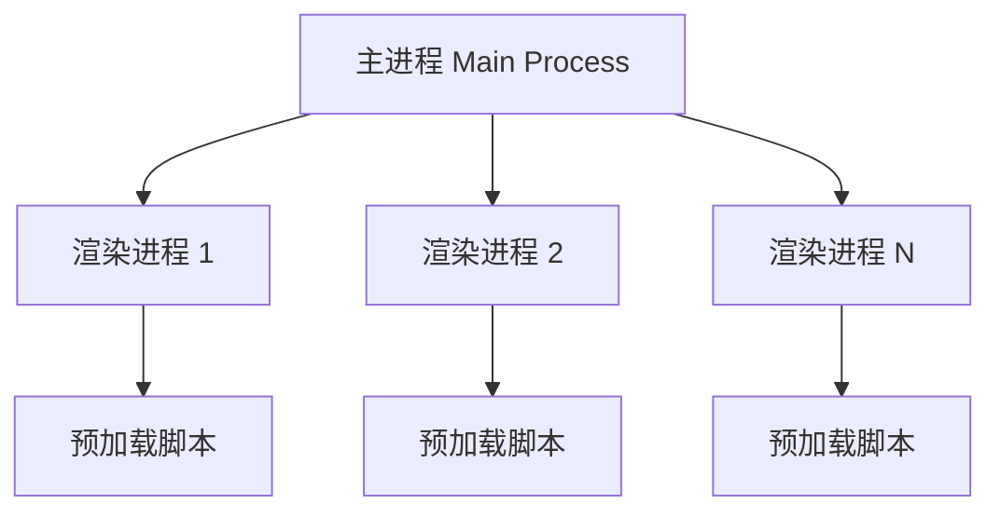

# Electron 进程间通信深度解析：高级前端开发实践
深入理解 Electron 的进程间通信（IPC）机制是构建高性能桌面应用的关键。本文将从架构设计、安全性、性能优化等多个维度，全面解析 Electron 的通信方式。

## Electron 架构概览

Electron 采用多进程架构，主要包含：

- **主进程（Main Process）**：应用的入口点，管理应用生命周期和创建渲染进程
- **渲染进程（Renderer Process）**：运行 Web 页面的进程，每个 BrowserWindow 对应一个渲染进程
- **预加载脚本（Preload Script）**：在渲染进程中运行，但具有 Node.js 访问权限的安全桥梁



## 核心通信方式详解

### 1. IPC 模块通信

#### 主进程到渲染进程（Main → Renderer）

```javascript
// 主进程 (main.js)
const { BrowserWindow, ipcMain } = require('electron')

const mainWindow = new BrowserWindow({
  width: 1200,
  height: 800,
  webPreferences: {
    nodeIntegration: false,
    contextIsolation: true,
    preload: path.join(__dirname, 'preload.js')
  }
})

// 发送消息到渲染进程
mainWindow.webContents.send('main-to-renderer', {
  type: 'UPDATE_STATUS',
  payload: { status: 'connected', timestamp: Date.now() }
})

// 监听来自渲染进程的消息
ipcMain.handle('get-app-version', async () => {
  return app.getVersion()
})

// 处理异步操作
ipcMain.handle('fetch-user-data', async (event, userId) => {
  try {
    const userData = await fetchUserFromDatabase(userId)
    return { success: true, data: userData }
  } catch (error) {
    return { success: false, error: error.message }
  }
})
```

#### 预加载脚本（安全桥梁）

```javascript
// preload.js
const { contextBridge, ipcRenderer } = require('electron')

// 安全地暴露 API 到渲染进程
contextBridge.exposeInMainWorld('electronAPI', {
  // 发送消息到主进程
  sendToMain: (channel, data) => {
    const validChannels = ['user-action', 'app-command', 'file-operation']
    if (validChannels.includes(channel)) {
      ipcRenderer.send(channel, data)
    }
  },

  // 调用主进程方法并等待返回
  invoke: (channel, ...args) => {
    const validChannels = ['get-app-version', 'fetch-user-data', 'save-file']
    if (validChannels.includes(channel)) {
      return ipcRenderer.invoke(channel, ...args)
    }
  },

  // 监听来自主进程的消息
  onMainMessage: (callback) => {
    ipcRenderer.on('main-to-renderer', (event, data) => {
      callback(data)
    })
  },

  // 移除监听器（防止内存泄漏）
  removeAllListeners: (channel) => {
    ipcRenderer.removeAllListeners(channel)
  }
})
```

#### 渲染进程使用

```javascript
// renderer.js (在网页中运行)
class ElectronCommunicator {
  constructor() {
    this.setupMessageHandlers()
  }

  setupMessageHandlers() {
    // 监听主进程消息
    window.electronAPI.onMainMessage((data) => {
      this.handleMainMessage(data)
    })
  }

  async handleMainMessage(data) {
    switch (data.type) {
      case 'UPDATE_STATUS':
        this.updateConnectionStatus(data.payload.status)
        break
      case 'NOTIFICATION':
        this.showNotification(data.payload.message)
        break
      default:
        console.warn('Unknown message type:', data.type)
    }
  }

  // 调用主进程 API
  async getAppInfo() {
    try {
      const version = await window.electronAPI.invoke('get-app-version')
      const userData = await window.electronAPI.invoke('fetch-user-data', this.userId)
      
      return { version, userData }
    } catch (error) {
      console.error('Failed to get app info:', error)
      throw error
    }
  }

  // 发送用户操作到主进程
  sendUserAction(action, payload) {
    window.electronAPI.sendToMain('user-action', {
      action,
      payload,
      timestamp: Date.now()
    })
  }
}

const communicator = new ElectronCommunicator()
```

### 2. 渲染进程间通信

#### 通过主进程中转

```javascript
// 主进程作为消息中转站
class IPCMessageBroker {
  constructor() {
    this.windows = new Map()
    this.setupIPC()
  }

  setupIPC() {
    ipcMain.handle('register-window', (event, windowId) => {
      this.windows.set(windowId, event.sender)
      return { success: true }
    })

    ipcMain.handle('send-to-window', (event, targetWindowId, message) => {
      const targetWindow = this.windows.get(targetWindowId)
      if (targetWindow && !targetWindow.isDestroyed()) {
        targetWindow.send('window-message', {
          from: this.getWindowId(event.sender),
          message
        })
        return { success: true }
      }
      return { success: false, error: 'Target window not found' }
    })

    ipcMain.handle('broadcast-message', (event, message) => {
      const senderId = this.getWindowId(event.sender)
      this.windows.forEach((webContents, windowId) => {
        if (windowId !== senderId && !webContents.isDestroyed()) {
          webContents.send('broadcast-message', {
            from: senderId,
            message
          })
        }
      })
      return { success: true }
    })
  }

  getWindowId(webContents) {
    for (const [id, contents] of this.windows.entries()) {
      if (contents === webContents) return id
    }
    return null
  }
}

const messageBroker = new IPCMessageBroker()
```

#### SharedArrayBuffer 高性能通信

```javascript
// 主进程设置共享内存
const sharedBuffer = new SharedArrayBuffer(1024 * 1024) // 1MB
const sharedArray = new Int32Array(sharedBuffer)

// 将共享缓冲区传递给渲染进程
mainWindow.webContents.send('shared-buffer', sharedBuffer)

// 渲染进程使用共享内存
window.electronAPI.onSharedBuffer((sharedBuffer) => {
  const sharedArray = new Int32Array(sharedBuffer)
  
  // 高性能数据交换
  const dataExchanger = {
    writeData(index, value) {
      Atomics.store(sharedArray, index, value)
      Atomics.notify(sharedArray, index, 1)
    },
    
    readData(index) {
      return Atomics.load(sharedArray, index)
    },
    
    waitForChange(index, expectedValue, timeout = 1000) {
      return Atomics.wait(sharedArray, index, expectedValue, timeout)
    }
  }
})
```

### 3. MessagePort API 通信

```javascript
// 主进程创建 MessageChannel
const { MessageChannelMain } = require('electron')

function createMessageChannel(window1, window2) {
  const { port1, port2 } = new MessageChannelMain()
  
  // 将端口发送给不同的渲染进程
  window1.webContents.postMessage('port', null, [port1])
  window2.webContents.postMessage('port', null, [port2])
}

// 渲染进程使用 MessagePort
window.addEventListener('message', (event) => {
  if (event.data === 'port') {
    const port = event.ports[0]
    
    // 设置消息处理器
    port.onmessage = (event) => {
      console.log('Received:', event.data)
    }
    
    // 发送消息
    port.postMessage({
      type: 'DIRECT_MESSAGE',
      payload: { data: 'Hello from another window!' }
    })
    
    port.start()
  }
})
```

## 高级通信模式

### 1. 事件驱动架构

```javascript
// 事件管理器
class ElectronEventManager {
  constructor() {
    this.events = new Map()
    this.middlewares = []
  }

  // 添加中间件
  use(middleware) {
    this.middlewares.push(middleware)
  }

  // 注册事件处理器
  on(eventName, handler, options = {}) {
    if (!this.events.has(eventName)) {
      this.events.set(eventName, [])
    }
    
    this.events.get(eventName).push({
      handler,
      once: options.once || false,
      priority: options.priority || 0
    })
    
    // 按优先级排序
    this.events.get(eventName).sort((a, b) => b.priority - a.priority)
  }

  // 触发事件
  async emit(eventName, data) {
    const handlers = this.events.get(eventName) || []
    
    // 应用中间件
    let processedData = data
    for (const middleware of this.middlewares) {
      processedData = await middleware(eventName, processedData)
    }
    
    // 执行处理器
    for (let i = handlers.length - 1; i >= 0; i--) {
      const { handler, once } = handlers[i]
      
      try {
        await handler(processedData)
        
        if (once) {
          handlers.splice(i, 1)
        }
      } catch (error) {
        console.error(`Error in event handler for ${eventName}:`, error)
      }
    }
  }
}

// 使用示例
const eventManager = new ElectronEventManager()

// 添加日志中间件
eventManager.use(async (eventName, data) => {
  console.log(`Event: ${eventName}`, data)
  return data
})

// 注册事件处理器
eventManager.on('user-login', async (userData) => {
  await updateUserInterface(userData)
}, { priority: 10 })

eventManager.on('user-login', async (userData) => {
  await logUserActivity(userData)
}, { priority: 5 })
```

### 2. 请求-响应模式

```javascript
// 请求管理器
class IPCRequestManager {
  constructor() {
    this.pendingRequests = new Map()
    this.requestId = 0
  }

  // 发送请求并等待响应
  async request(channel, data, timeout = 5000) {
    const requestId = ++this.requestId
    
    return new Promise((resolve, reject) => {
      const timer = setTimeout(() => {
        this.pendingRequests.delete(requestId)
        reject(new Error(`Request timeout: ${channel}`))
      }, timeout)

      this.pendingRequests.set(requestId, {
        resolve,
        reject,
        timer
      })

      // 发送请求
      ipcRenderer.send('ipc-request', {
        id: requestId,
        channel,
        data
      })
    })
  }

  // 处理响应
  handleResponse(response) {
    const { id, success, data, error } = response
    const pending = this.pendingRequests.get(id)
    
    if (pending) {
      clearTimeout(pending.timer)
      this.pendingRequests.delete(id)
      
      if (success) {
        pending.resolve(data)
      } else {
        pending.reject(new Error(error))
      }
    }
  }
}

// 主进程处理请求
ipcMain.on('ipc-request', async (event, { id, channel, data }) => {
  try {
    const result = await handleRequest(channel, data)
    event.reply('ipc-response', {
      id,
      success: true,
      data: result
    })
  } catch (error) {
    event.reply('ipc-response', {
      id,
      success: false,
      error: error.message
    })
  }
})
```

### 3. 流式数据传输

```javascript
// 流式数据处理器
class StreamProcessor {
  constructor() {
    this.streams = new Map()
  }

  // 创建数据流
  createStream(streamId, options = {}) {
    const stream = {
      id: streamId,
      buffer: [],
      chunkSize: options.chunkSize || 1024,
      onData: options.onData || (() => {}),
      onEnd: options.onEnd || (() => {}),
      onError: options.onError || (() => {})
    }
    
    this.streams.set(streamId, stream)
    return stream
  }

  // 发送数据块
  sendChunk(streamId, chunk, isLast = false) {
    ipcRenderer.send('stream-chunk', {
      streamId,
      chunk,
      isLast
    })
  }

  // 处理接收到的数据块
  handleChunk(data) {
    const { streamId, chunk, isLast } = data
    const stream = this.streams.get(streamId)
    
    if (stream) {
      stream.buffer.push(chunk)
      stream.onData(chunk)
      
      if (isLast) {
        const completeData = stream.buffer.join('')
        stream.onEnd(completeData)
        this.streams.delete(streamId)
      }
    }
  }
}

// 使用示例：大文件传输
async function transferLargeFile(filePath) {
  const streamId = `file-${Date.now()}`
  const fileStream = fs.createReadStream(filePath, { 
    highWaterMark: 64 * 1024 // 64KB chunks
  })
  
  const processor = new StreamProcessor()
  
  fileStream.on('data', (chunk) => {
    processor.sendChunk(streamId, chunk.toString('base64'))
  })
  
  fileStream.on('end', () => {
    processor.sendChunk(streamId, '', true)
  })
  
  fileStream.on('error', (error) => {
    ipcRenderer.send('stream-error', { streamId, error: error.message })
  })
}
```

## 性能优化策略

### 1. 消息批处理

```javascript
class MessageBatcher {
  constructor(options = {}) {
    this.batchSize = options.batchSize || 100
    this.flushInterval = options.flushInterval || 16 // 60fps
    this.queue = []
    this.timer = null
  }

  add(message) {
    this.queue.push({
      ...message,
      timestamp: performance.now()
    })

    if (this.queue.length >= this.batchSize) {
      this.flush()
    } else if (!this.timer) {
      this.timer = setTimeout(() => this.flush(), this.flushInterval)
    }
  }

  flush() {
    if (this.queue.length === 0) return

    const batch = this.queue.splice(0)
    if (this.timer) {
      clearTimeout(this.timer)
      this.timer = null
    }

    // 发送批量消息
    ipcRenderer.send('message-batch', {
      messages: batch,
      batchId: Date.now()
    })
  }
}
```

### 2. 内存管理

```javascript
class IPCMemoryManager {
  constructor() {
    this.messageCache = new Map()
    this.maxCacheSize = 1000
    this.cleanupInterval = 30000 // 30秒
    
    this.startCleanup()
  }

  cacheMessage(id, message) {
    if (this.messageCache.size >= this.maxCacheSize) {
      // 删除最旧的消息
      const firstKey = this.messageCache.keys().next().value
      this.messageCache.delete(firstKey)
    }
    
    this.messageCache.set(id, {
      message,
      timestamp: Date.now()
    })
  }

  startCleanup() {
    setInterval(() => {
      const now = Date.now()
      const expireTime = 5 * 60 * 1000 // 5分钟

      for (const [id, data] of this.messageCache.entries()) {
        if (now - data.timestamp > expireTime) {
          this.messageCache.delete(id)
        }
      }
    }, this.cleanupInterval)
  }
}
```

## 安全最佳实践

### 1. 消息验证

```javascript
// 消息验证器
class MessageValidator {
  constructor() {
    this.schemas = new Map()
  }

  registerSchema(channel, schema) {
    this.schemas.set(channel, schema)
  }

  validate(channel, data) {
    const schema = this.schemas.get(channel)
    if (!schema) {
      throw new Error(`No schema found for channel: ${channel}`)
    }

    return this.validateAgainstSchema(data, schema)
  }

  validateAgainstSchema(data, schema) {
    // 简化的验证逻辑
    for (const [key, type] of Object.entries(schema)) {
      if (!(key in data)) {
        throw new Error(`Missing required field: ${key}`)
      }
      
      if (typeof data[key] !== type) {
        throw new Error(`Invalid type for field ${key}: expected ${type}`)
      }
    }
    
    return true
  }
}

// 使用示例
const validator = new MessageValidator()

validator.registerSchema('user-data', {
  id: 'number',
  name: 'string',
  email: 'string'
})

// 在预加载脚本中验证消息
contextBridge.exposeInMainWorld('electronAPI', {
  sendUserData: (userData) => {
    try {
      validator.validate('user-data', userData)
      ipcRenderer.send('user-data', userData)
    } catch (error) {
      console.error('Validation failed:', error.message)
      throw error
    }
  }
})
```

### 2. 权限控制

```javascript
// 权限管理器
class PermissionManager {
  constructor() {
    this.permissions = new Map()
  }

  setPermissions(windowId, permissions) {
    this.permissions.set(windowId, new Set(permissions))
  }

  hasPermission(windowId, action) {
    const windowPermissions = this.permissions.get(windowId)
    return windowPermissions && windowPermissions.has(action)
  }

  checkPermission(event, action) {
    const windowId = this.getWindowId(event.sender)
    if (!this.hasPermission(windowId, action)) {
      throw new Error(`Permission denied: ${action}`)
    }
  }
}

// 在主进程中使用
const permissionManager = new PermissionManager()

ipcMain.handle('file-operation', (event, operation) => {
  try {
    permissionManager.checkPermission(event, 'file-access')
    return performFileOperation(operation)
  } catch (error) {
    return { success: false, error: error.message }
  }
})
```

## 总结

Electron 的进程间通信是构建高质量桌面应用的核心技术。我们需要：

1. **选择合适的通信方式**：根据场景选择 IPC、MessagePort 或 SharedArrayBuffer
2. **注重安全性**：使用 contextIsolation 和消息验证
3. **优化性能**：实施批处理、缓存和内存管理
4. **设计良好的架构**：采用事件驱动和请求-响应模式
5. **处理错误和边界情况**：确保应用的稳定性

掌握这些高级技术，能够帮助我们构建出性能优异、安全可靠的 Electron 应用。

## 实战案例：构建高性能文件管理器

让我们通过一个实际案例来展示这些通信技术的综合应用：

### 架构设计

```javascript
// 主进程 - 文件管理器核心
class FileManagerCore {
  constructor() {
    this.fileWatchers = new Map()
    this.operationQueue = []
    this.setupIPC()
  }

  setupIPC() {
    // 文件操作请求
    ipcMain.handle('file-operation', async (event, operation) => {
      return await this.handleFileOperation(operation)
    })

    // 批量文件操作
    ipcMain.handle('batch-file-operation', async (event, operations) => {
      return await this.handleBatchOperations(operations)
    })

    // 文件监听
    ipcMain.handle('watch-directory', (event, dirPath) => {
      return this.watchDirectory(dirPath, event.sender)
    })
  }

  async handleFileOperation(operation) {
    const { type, source, destination, options = {} } = operation

    try {
      switch (type) {
        case 'copy':
          return await this.copyFile(source, destination, options)
        case 'move':
          return await this.moveFile(source, destination, options)
        case 'delete':
          return await this.deleteFile(source, options)
        case 'create':
          return await this.createFile(source, options)
        default:
          throw new Error(`Unknown operation: ${type}`)
      }
    } catch (error) {
      return { success: false, error: error.message }
    }
  }

  async copyFile(source, destination, options) {
    const stats = await fs.promises.stat(source)
    const totalSize = stats.size
    let copiedSize = 0

    return new Promise((resolve, reject) => {
      const readStream = fs.createReadStream(source)
      const writeStream = fs.createWriteStream(destination)

      readStream.on('data', (chunk) => {
        copiedSize += chunk.length
        const progress = (copiedSize / totalSize) * 100

        // 发送进度更新
        this.sendProgressUpdate(options.windowId, {
          operation: 'copy',
          source,
          destination,
          progress: Math.round(progress)
        })
      })

      writeStream.on('finish', () => {
        resolve({ success: true, copiedSize })
      })

      readStream.on('error', reject)
      writeStream.on('error', reject)
      readStream.pipe(writeStream)
    })
  }

  watchDirectory(dirPath, webContents) {
    if (this.fileWatchers.has(dirPath)) {
      return { success: true, message: 'Already watching' }
    }

    const watcher = chokidar.watch(dirPath, {
      ignored: /(^|[\/\\])\../, // 忽略隐藏文件
      persistent: true
    })

    watcher
      .on('add', path => this.sendFileEvent(webContents, 'add', path))
      .on('change', path => this.sendFileEvent(webContents, 'change', path))
      .on('unlink', path => this.sendFileEvent(webContents, 'unlink', path))

    this.fileWatchers.set(dirPath, watcher)
    return { success: true }
  }

  sendFileEvent(webContents, event, path) {
    if (!webContents.isDestroyed()) {
      webContents.send('file-event', { event, path, timestamp: Date.now() })
    }
  }

  sendProgressUpdate(windowId, progress) {
    const window = BrowserWindow.fromId(windowId)
    if (window && !window.isDestroyed()) {
      window.webContents.send('operation-progress', progress)
    }
  }
}
```

### 渲染进程 - UI 层

```javascript
// 文件管理器 UI 控制器
class FileManagerUI {
  constructor() {
    this.currentPath = '/'
    this.selectedFiles = new Set()
    this.operationQueue = new OperationQueue()
    this.setupEventHandlers()
  }

  setupEventHandlers() {
    // 监听文件系统事件
    window.electronAPI.onFileEvent((event) => {
      this.handleFileSystemEvent(event)
    })

    // 监听操作进度
    window.electronAPI.onOperationProgress((progress) => {
      this.updateProgressBar(progress)
    })

    // 设置拖拽处理
    this.setupDragAndDrop()
  }

  async loadDirectory(path) {
    try {
      this.showLoading(true)

      const result = await window.electronAPI.invoke('file-operation', {
        type: 'list',
        source: path
      })

      if (result.success) {
        this.renderFileList(result.files)
        this.currentPath = path

        // 开始监听目录变化
        await window.electronAPI.invoke('watch-directory', path)
      } else {
        this.showError(result.error)
      }
    } catch (error) {
      this.showError(error.message)
    } finally {
      this.showLoading(false)
    }
  }

  async copyFiles(files, destination) {
    const operations = files.map(file => ({
      type: 'copy',
      source: file.path,
      destination: path.join(destination, file.name),
      options: { windowId: this.getWindowId() }
    }))

    try {
      const results = await window.electronAPI.invoke('batch-file-operation', operations)
      this.handleBatchResults(results)
    } catch (error) {
      this.showError(error.message)
    }
  }

  setupDragAndDrop() {
    const fileList = document.getElementById('file-list')

    fileList.addEventListener('dragstart', (e) => {
      const fileElement = e.target.closest('.file-item')
      if (fileElement) {
        const filePath = fileElement.dataset.path
        e.dataTransfer.setData('text/plain', filePath)
        e.dataTransfer.effectAllowed = 'copyMove'
      }
    })

    fileList.addEventListener('dragover', (e) => {
      e.preventDefault()
      e.dataTransfer.dropEffect = 'copy'
    })

    fileList.addEventListener('drop', async (e) => {
      e.preventDefault()
      const sourcePath = e.dataTransfer.getData('text/plain')
      const targetElement = e.target.closest('.file-item')

      if (targetElement && targetElement.dataset.isDirectory) {
        const targetPath = targetElement.dataset.path
        await this.copyFiles([{ path: sourcePath }], targetPath)
      }
    })
  }

  handleFileSystemEvent(event) {
    const { event: eventType, path, timestamp } = event

    switch (eventType) {
      case 'add':
        this.addFileToList(path)
        break
      case 'change':
        this.updateFileInList(path)
        break
      case 'unlink':
        this.removeFileFromList(path)
        break
    }
  }
}
```

### 操作队列管理

```javascript
// 操作队列管理器
class OperationQueue {
  constructor() {
    this.queue = []
    this.running = false
    this.maxConcurrent = 3
    this.activeOperations = 0
  }

  add(operation) {
    const operationId = this.generateId()
    const queueItem = {
      id: operationId,
      operation,
      status: 'pending',
      progress: 0,
      startTime: null,
      endTime: null
    }

    this.queue.push(queueItem)
    this.processQueue()

    return operationId
  }

  async processQueue() {
    if (this.running || this.activeOperations >= this.maxConcurrent) {
      return
    }

    const nextOperation = this.queue.find(op => op.status === 'pending')
    if (!nextOperation) {
      return
    }

    this.running = true
    this.activeOperations++
    nextOperation.status = 'running'
    nextOperation.startTime = Date.now()

    try {
      const result = await this.executeOperation(nextOperation)
      nextOperation.status = 'completed'
      nextOperation.result = result
    } catch (error) {
      nextOperation.status = 'failed'
      nextOperation.error = error
    } finally {
      nextOperation.endTime = Date.now()
      this.activeOperations--
      this.running = false

      // 继续处理队列
      setTimeout(() => this.processQueue(), 0)
    }
  }

  async executeOperation(queueItem) {
    const { operation } = queueItem

    // 设置进度回调
    operation.onProgress = (progress) => {
      queueItem.progress = progress
      this.notifyProgress(queueItem)
    }

    return await window.electronAPI.invoke('file-operation', operation)
  }

  notifyProgress(queueItem) {
    // 通知 UI 更新进度
    document.dispatchEvent(new CustomEvent('operation-progress', {
      detail: queueItem
    }))
  }

  generateId() {
    return `op_${Date.now()}_${Math.random().toString(36).substr(2, 9)}`
  }

  getStatus() {
    return {
      total: this.queue.length,
      pending: this.queue.filter(op => op.status === 'pending').length,
      running: this.queue.filter(op => op.status === 'running').length,
      completed: this.queue.filter(op => op.status === 'completed').length,
      failed: this.queue.filter(op => op.status === 'failed').length
    }
  }
}
```

## 调试和监控

### 通信监控器

```javascript
// IPC 通信监控器
class IPCMonitor {
  constructor() {
    this.messages = []
    this.maxMessages = 1000
    this.filters = new Set()
    this.setupMonitoring()
  }

  setupMonitoring() {
    // 拦截发送的消息
    const originalSend = ipcRenderer.send
    ipcRenderer.send = (channel, ...args) => {
      this.logMessage('send', channel, args)
      return originalSend.call(ipcRenderer, channel, ...args)
    }

    // 拦截调用的方法
    const originalInvoke = ipcRenderer.invoke
    ipcRenderer.invoke = async (channel, ...args) => {
      const startTime = performance.now()
      this.logMessage('invoke-start', channel, args)

      try {
        const result = await originalInvoke.call(ipcRenderer, channel, ...args)
        const duration = performance.now() - startTime
        this.logMessage('invoke-end', channel, { result, duration })
        return result
      } catch (error) {
        const duration = performance.now() - startTime
        this.logMessage('invoke-error', channel, { error, duration })
        throw error
      }
    }

    // 监听接收的消息
    ipcRenderer.on('*', (event, ...args) => {
      this.logMessage('receive', event.channel || 'unknown', args)
    })
  }

  logMessage(type, channel, data) {
    if (this.filters.has(channel)) {
      return
    }

    const message = {
      id: this.generateId(),
      type,
      channel,
      data: this.sanitizeData(data),
      timestamp: Date.now(),
      stack: new Error().stack
    }

    this.messages.push(message)

    if (this.messages.length > this.maxMessages) {
      this.messages.shift()
    }

    // 实时输出到控制台（开发模式）
    if (process.env.NODE_ENV === 'development') {
      console.group(`IPC ${type.toUpperCase()}: ${channel}`)
      console.log('Data:', data)
      console.log('Timestamp:', new Date(message.timestamp).toISOString())
      console.groupEnd()
    }
  }

  sanitizeData(data) {
    try {
      return JSON.parse(JSON.stringify(data))
    } catch {
      return '[Circular or Non-serializable]'
    }
  }

  getMessages(filter = {}) {
    let filtered = this.messages

    if (filter.channel) {
      filtered = filtered.filter(msg => msg.channel.includes(filter.channel))
    }

    if (filter.type) {
      filtered = filtered.filter(msg => msg.type === filter.type)
    }

    if (filter.since) {
      filtered = filtered.filter(msg => msg.timestamp >= filter.since)
    }

    return filtered
  }

  exportLogs() {
    const logs = {
      exportTime: Date.now(),
      messages: this.messages,
      stats: this.getStats()
    }

    return JSON.stringify(logs, null, 2)
  }

  getStats() {
    const stats = {
      total: this.messages.length,
      byType: {},
      byChannel: {},
      averageResponseTime: 0
    }

    let totalResponseTime = 0
    let responseCount = 0

    this.messages.forEach(msg => {
      // 按类型统计
      stats.byType[msg.type] = (stats.byType[msg.type] || 0) + 1

      // 按通道统计
      stats.byChannel[msg.channel] = (stats.byChannel[msg.channel] || 0) + 1

      // 响应时间统计
      if (msg.type === 'invoke-end' && msg.data.duration) {
        totalResponseTime += msg.data.duration
        responseCount++
      }
    })

    if (responseCount > 0) {
      stats.averageResponseTime = totalResponseTime / responseCount
    }

    return stats
  }

  generateId() {
    return `msg_${Date.now()}_${Math.random().toString(36).substr(2, 9)}`
  }
}

// 在开发环境中启用监控
if (process.env.NODE_ENV === 'development') {
  window.ipcMonitor = new IPCMonitor()
}
```

## 错误处理和恢复

### 错误处理策略

```javascript
// 全局错误处理器
class ElectronErrorHandler {
  constructor() {
    this.errorQueue = []
    this.maxRetries = 3
    this.retryDelay = 1000
    this.setupErrorHandling()
  }

  setupErrorHandling() {
    // 处理未捕获的异常
    process.on('uncaughtException', (error) => {
      this.handleCriticalError('uncaughtException', error)
    })

    // 处理未处理的 Promise 拒绝
    process.on('unhandledRejection', (reason, promise) => {
      this.handleCriticalError('unhandledRejection', reason)
    })

    // IPC 错误处理
    ipcMain.on('renderer-error', (event, errorData) => {
      this.handleRendererError(errorData)
    })
  }

  handleCriticalError(type, error) {
    const errorInfo = {
      type,
      message: error.message,
      stack: error.stack,
      timestamp: Date.now(),
      process: 'main'
    }

    console.error('Critical Error:', errorInfo)

    // 记录错误日志
    this.logError(errorInfo)

    // 通知所有渲染进程
    BrowserWindow.getAllWindows().forEach(window => {
      if (!window.isDestroyed()) {
        window.webContents.send('critical-error', errorInfo)
      }
    })
  }

  handleRendererError(errorData) {
    console.error('Renderer Error:', errorData)
    this.logError({ ...errorData, process: 'renderer' })
  }

  async retryOperation(operation, maxRetries = this.maxRetries) {
    let lastError

    for (let attempt = 1; attempt <= maxRetries; attempt++) {
      try {
        return await operation()
      } catch (error) {
        lastError = error

        if (attempt < maxRetries) {
          const delay = this.retryDelay * Math.pow(2, attempt - 1) // 指数退避
          await this.sleep(delay)
        }
      }
    }

    throw lastError
  }

  sleep(ms) {
    return new Promise(resolve => setTimeout(resolve, ms))
  }

  logError(errorInfo) {
    // 这里可以集成日志系统，如 Winston 或发送到远程服务
    const logEntry = {
      ...errorInfo,
      id: this.generateId(),
      appVersion: app.getVersion(),
      platform: process.platform,
      arch: process.arch
    }

    this.errorQueue.push(logEntry)

    // 可以定期发送错误日志到服务器
    this.flushErrorLogs()
  }

  async flushErrorLogs() {
    if (this.errorQueue.length === 0) return

    try {
      // 发送错误日志到服务器或写入文件
      await this.sendErrorLogs(this.errorQueue)
      this.errorQueue = []
    } catch (error) {
      console.error('Failed to flush error logs:', error)
    }
  }

  generateId() {
    return `err_${Date.now()}_${Math.random().toString(36).substr(2, 9)}`
  }
}

const errorHandler = new ElectronErrorHandler()
```

通过这个完整的实战案例，我们展示了如何在实际项目中综合运用 Electron 的各种通信技术，构建一个高性能、可靠的桌面应用。这些技术和模式可以应用到各种 Electron 项目中，帮助开发者构建出专业级的桌面应用程序。
