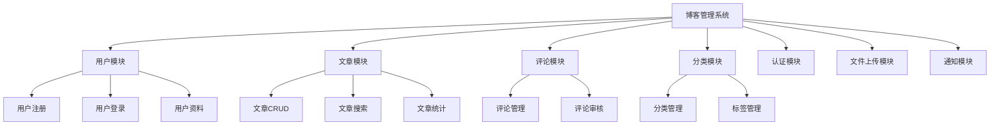

# NestJS 实战：构建企业级博客管理系统

本文将通过构建一个完整的博客管理系统，综合运用 NestJS 的所有核心知识点，包括模块化架构、依赖注入、中间件、守卫、拦截器、管道、过滤器等高级特性。

## 项目架构设计

### 系统功能模块



### 技术栈选择

- **框架**: NestJS + TypeScript
- **数据库**: PostgreSQL + TypeORM
- **认证**: JWT + Passport
- **缓存**: Redis
- **文件存储**: AWS S3 / 本地存储
- **API文档**: Swagger
- **测试**: Jest + Supertest

## 项目初始化

### 1. 创建项目结构

```bash
# 创建新项目
nest new blog-management-system

# 安装必要依赖
npm install @nestjs/typeorm typeorm pg
npm install @nestjs/jwt @nestjs/passport passport passport-jwt
npm install @nestjs/swagger swagger-ui-express
npm install @nestjs/config
npm install class-validator class-transformer
npm install bcryptjs
npm install redis ioredis

# 安装开发依赖
npm install -D @types/bcryptjs @types/passport-jwt
```

### 2. 项目目录结构

```
src/
├── common/                 # 公共模块
│   ├── decorators/        # 自定义装饰器
│   ├── filters/           # 异常过滤器
│   ├── guards/            # 守卫
│   ├── interceptors/      # 拦截器
│   ├── middleware/        # 中间件
│   └── pipes/             # 管道
├── config/                # 配置文件
├── modules/               # 业务模块
│   ├── auth/              # 认证模块
│   ├── users/             # 用户模块
│   ├── articles/          # 文章模块
│   ├── comments/          # 评论模块
│   ├── categories/        # 分类模块
│   └── upload/            # 文件上传模块
├── database/              # 数据库相关
│   ├── entities/          # 实体类
│   └── migrations/        # 数据库迁移
└── main.ts               # 应用入口
```

## 核心模块实现

### 1. 配置模块 (Configuration)

```typescript
// config/database.config.ts
import { registerAs } from '@nestjs/config';

export default registerAs('database', () => ({
  type: 'postgres',
  host: process.env.DB_HOST || 'localhost',
  port: parseInt(process.env.DB_PORT, 10) || 5432,
  username: process.env.DB_USERNAME || 'postgres',
  password: process.env.DB_PASSWORD || 'password',
  database: process.env.DB_NAME || 'blog_db',
  entities: [__dirname + '/../**/*.entity{.ts,.js}'],
  synchronize: process.env.NODE_ENV !== 'production',
  logging: process.env.NODE_ENV === 'development',
}));

// config/jwt.config.ts
import { registerAs } from '@nestjs/config';

export default registerAs('jwt', () => ({
  secret: process.env.JWT_SECRET || 'your-secret-key',
  expiresIn: process.env.JWT_EXPIRES_IN || '7d',
  refreshSecret: process.env.JWT_REFRESH_SECRET || 'refresh-secret',
  refreshExpiresIn: process.env.JWT_REFRESH_EXPIRES_IN || '30d',
}));
```

### 2. 数据库实体设计

```typescript
// database/entities/user.entity.ts
import {
  Entity,
  PrimaryGeneratedColumn,
  Column,
  CreateDateColumn,
  UpdateDateColumn,
  OneToMany,
  BeforeInsert,
  BeforeUpdate,
} from 'typeorm';
import { Exclude } from 'class-transformer';
import * as bcrypt from 'bcryptjs';
import { Article } from './article.entity';
import { Comment } from './comment.entity';

export enum UserRole {
  ADMIN = 'admin',
  AUTHOR = 'author',
  USER = 'user',
}

export enum UserStatus {
  ACTIVE = 'active',
  INACTIVE = 'inactive',
  BANNED = 'banned',
}

@Entity('users')
export class User {
  @PrimaryGeneratedColumn('uuid')
  id: string;

  @Column({ unique: true })
  email: string;

  @Column({ unique: true })
  username: string;

  @Column()
  @Exclude()
  password: string;

  @Column({ nullable: true })
  firstName: string;

  @Column({ nullable: true })
  lastName: string;

  @Column({ nullable: true })
  avatar: string;

  @Column({ nullable: true })
  bio: string;

  @Column({
    type: 'enum',
    enum: UserRole,
    default: UserRole.USER,
  })
  role: UserRole;

  @Column({
    type: 'enum',
    enum: UserStatus,
    default: UserStatus.ACTIVE,
  })
  status: UserStatus;

  @Column({ default: false })
  emailVerified: boolean;

  @Column({ nullable: true })
  emailVerificationToken: string;

  @Column({ nullable: true })
  passwordResetToken: string;

  @Column({ nullable: true })
  passwordResetExpires: Date;

  @CreateDateColumn()
  createdAt: Date;

  @UpdateDateColumn()
  updatedAt: Date;

  @OneToMany(() => Article, (article) => article.author)
  articles: Article[];

  @OneToMany(() => Comment, (comment) => comment.author)
  comments: Comment[];

  @BeforeInsert()
  @BeforeUpdate()
  async hashPassword() {
    if (this.password) {
      this.password = await bcrypt.hash(this.password, 12);
    }
  }

  async validatePassword(password: string): Promise<boolean> {
    return bcrypt.compare(password, this.password);
  }

  get fullName(): string {
    return `${this.firstName || ''} ${this.lastName || ''}`.trim();
  }
}
```

```typescript
// database/entities/article.entity.ts
import {
  Entity,
  PrimaryGeneratedColumn,
  Column,
  CreateDateColumn,
  UpdateDateColumn,
  ManyToOne,
  OneToMany,
  ManyToMany,
  JoinTable,
  Index,
} from 'typeorm';
import { User } from './user.entity';
import { Category } from './category.entity';
import { Comment } from './comment.entity';
import { Tag } from './tag.entity';

export enum ArticleStatus {
  DRAFT = 'draft',
  PUBLISHED = 'published',
  ARCHIVED = 'archived',
}

@Entity('articles')
@Index(['title', 'content'])
export class Article {
  @PrimaryGeneratedColumn('uuid')
  id: string;

  @Column()
  title: string;

  @Column({ unique: true })
  slug: string;

  @Column('text')
  content: string;

  @Column('text', { nullable: true })
  excerpt: string;

  @Column({ nullable: true })
  featuredImage: string;

  @Column({
    type: 'enum',
    enum: ArticleStatus,
    default: ArticleStatus.DRAFT,
  })
  status: ArticleStatus;

  @Column({ default: 0 })
  viewCount: number;

  @Column({ default: 0 })
  likeCount: number;

  @Column({ default: true })
  allowComments: boolean;

  @Column('simple-array', { nullable: true })
  metaKeywords: string[];

  @Column({ nullable: true })
  metaDescription: string;

  @Column({ nullable: true })
  publishedAt: Date;

  @CreateDateColumn()
  createdAt: Date;

  @UpdateDateColumn()
  updatedAt: Date;

  @ManyToOne(() => User, (user) => user.articles, { eager: true })
  author: User;

  @ManyToOne(() => Category, (category) => category.articles, { eager: true })
  category: Category;

  @OneToMany(() => Comment, (comment) => comment.article)
  comments: Comment[];

  @ManyToMany(() => Tag, (tag) => tag.articles, { eager: true })
  @JoinTable()
  tags: Tag[];
}
```

### 3. 认证模块实现

```typescript
// modules/auth/auth.module.ts
import { Module } from '@nestjs/common';
import { JwtModule } from '@nestjs/jwt';
import { PassportModule } from '@nestjs/passport';
import { ConfigModule, ConfigService } from '@nestjs/config';
import { AuthService } from './auth.service';
import { AuthController } from './auth.controller';
import { JwtStrategy } from './strategies/jwt.strategy';
import { LocalStrategy } from './strategies/local.strategy';
import { UsersModule } from '../users/users.module';

@Module({
  imports: [
    UsersModule,
    PassportModule.register({ defaultStrategy: 'jwt' }),
    JwtModule.registerAsync({
      imports: [ConfigModule],
      useFactory: async (configService: ConfigService) => ({
        secret: configService.get('jwt.secret'),
        signOptions: {
          expiresIn: configService.get('jwt.expiresIn'),
        },
      }),
      inject: [ConfigService],
    }),
  ],
  controllers: [AuthController],
  providers: [AuthService, JwtStrategy, LocalStrategy],
  exports: [AuthService, JwtModule],
})
export class AuthModule {}
```

```typescript
// modules/auth/auth.service.ts
import {
  Injectable,
  UnauthorizedException,
  BadRequestException,
  ConflictException,
} from '@nestjs/common';
import { JwtService } from '@nestjs/jwt';
import { ConfigService } from '@nestjs/config';
import { UsersService } from '../users/users.service';
import { User } from '../../database/entities/user.entity';
import { RegisterDto } from './dto/register.dto';
import { LoginDto } from './dto/login.dto';
import { JwtPayload } from './interfaces/jwt-payload.interface';
import { AuthResponse } from './interfaces/auth-response.interface';

@Injectable()
export class AuthService {
  constructor(
    private readonly usersService: UsersService,
    private readonly jwtService: JwtService,
    private readonly configService: ConfigService,
  ) {}

  async register(registerDto: RegisterDto): Promise<AuthResponse> {
    const { email, username, password, firstName, lastName } = registerDto;

    // 检查用户是否已存在
    const existingUser = await this.usersService.findByEmailOrUsername(
      email,
      username,
    );
    if (existingUser) {
      throw new ConflictException('用户已存在');
    }

    // 创建新用户
    const user = await this.usersService.create({
      email,
      username,
      password,
      firstName,
      lastName,
    });

    // 生成令牌
    const tokens = await this.generateTokens(user);

    return {
      user,
      ...tokens,
    };
  }

  async login(loginDto: LoginDto): Promise<AuthResponse> {
    const { email, password } = loginDto;

    // 验证用户
    const user = await this.validateUser(email, password);
    if (!user) {
      throw new UnauthorizedException('邮箱或密码错误');
    }

    // 生成令牌
    const tokens = await this.generateTokens(user);

    return {
      user,
      ...tokens,
    };
  }

  async validateUser(email: string, password: string): Promise<User | null> {
    const user = await this.usersService.findByEmail(email);
    if (user && (await user.validatePassword(password))) {
      return user;
    }
    return null;
  }

  async validateUserById(userId: string): Promise<User> {
    const user = await this.usersService.findById(userId);
    if (!user) {
      throw new UnauthorizedException('用户不存在');
    }
    return user;
  }

  private async generateTokens(user: User) {
    const payload: JwtPayload = {
      sub: user.id,
      email: user.email,
      role: user.role,
    };

    const [accessToken, refreshToken] = await Promise.all([
      this.jwtService.signAsync(payload),
      this.jwtService.signAsync(payload, {
        secret: this.configService.get('jwt.refreshSecret'),
        expiresIn: this.configService.get('jwt.refreshExpiresIn'),
      }),
    ]);

    return {
      accessToken,
      refreshToken,
    };
  }

  async refreshTokens(refreshToken: string): Promise<AuthResponse> {
    try {
      const payload = this.jwtService.verify(refreshToken, {
        secret: this.configService.get('jwt.refreshSecret'),
      });

      const user = await this.validateUserById(payload.sub);
      const tokens = await this.generateTokens(user);

      return {
        user,
        ...tokens,
      };
    } catch (error) {
      throw new UnauthorizedException('无效的刷新令牌');
    }
  }
}
```

### 4. 守卫与权限控制

```typescript
// common/guards/jwt-auth.guard.ts
import { Injectable, ExecutionContext } from '@nestjs/common';
import { AuthGuard } from '@nestjs/passport';
import { Reflector } from '@nestjs/core';
import { IS_PUBLIC_KEY } from '../decorators/public.decorator';

@Injectable()
export class JwtAuthGuard extends AuthGuard('jwt') {
  constructor(private reflector: Reflector) {
    super();
  }

  canActivate(context: ExecutionContext) {
    const isPublic = this.reflector.getAllAndOverride<boolean>(IS_PUBLIC_KEY, [
      context.getHandler(),
      context.getClass(),
    ]);

    if (isPublic) {
      return true;
    }

    return super.canActivate(context);
  }
}

// common/guards/roles.guard.ts
import { Injectable, CanActivate, ExecutionContext } from '@nestjs/common';
import { Reflector } from '@nestjs/core';
import { UserRole } from '../../database/entities/user.entity';
import { ROLES_KEY } from '../decorators/roles.decorator';

@Injectable()
export class RolesGuard implements CanActivate {
  constructor(private reflector: Reflector) {}

  canActivate(context: ExecutionContext): boolean {
    const requiredRoles = this.reflector.getAllAndOverride<UserRole[]>(
      ROLES_KEY,
      [context.getHandler(), context.getClass()],
    );

    if (!requiredRoles) {
      return true;
    }

    const { user } = context.switchToHttp().getRequest();
    return requiredRoles.some((role) => user.role === role);
  }
}
```

### 5. 自定义装饰器

```typescript
// common/decorators/public.decorator.ts
import { SetMetadata } from '@nestjs/common';

export const IS_PUBLIC_KEY = 'isPublic';
export const Public = () => SetMetadata(IS_PUBLIC_KEY, true);

// common/decorators/roles.decorator.ts
import { SetMetadata } from '@nestjs/common';
import { UserRole } from '../../database/entities/user.entity';

export const ROLES_KEY = 'roles';
export const Roles = (...roles: UserRole[]) => SetMetadata(ROLES_KEY, roles);

// common/decorators/current-user.decorator.ts
import { createParamDecorator, ExecutionContext } from '@nestjs/common';
import { User } from '../../database/entities/user.entity';

export const CurrentUser = createParamDecorator(
  (data: keyof User | undefined, ctx: ExecutionContext) => {
    const request = ctx.switchToHttp().getRequest();
    const user = request.user;

    return data ? user?.[data] : user;
  },
);

// common/decorators/api-paginated-response.decorator.ts
import { applyDecorators, Type } from '@nestjs/common';
import { ApiOkResponse, getSchemaPath } from '@nestjs/swagger';

export const ApiPaginatedResponse = <TModel extends Type<any>>(
  model: TModel,
) => {
  return applyDecorators(
    ApiOkResponse({
      schema: {
        allOf: [
          {
            properties: {
              data: {
                type: 'array',
                items: { $ref: getSchemaPath(model) },
              },
              meta: {
                type: 'object',
                properties: {
                  total: { type: 'number' },
                  page: { type: 'number' },
                  limit: { type: 'number' },
                  totalPages: { type: 'number' },
                },
              },
            },
          },
        ],
      },
    }),
  );
};
```

### 6. 拦截器实现

```typescript
// common/interceptors/transform.interceptor.ts
import {
  Injectable,
  NestInterceptor,
  ExecutionContext,
  CallHandler,
} from '@nestjs/common';
import { Observable } from 'rxjs';
import { map } from 'rxjs/operators';

export interface Response<T> {
  success: boolean;
  data: T;
  message?: string;
  timestamp: string;
  path: string;
}

@Injectable()
export class TransformInterceptor<T>
  implements NestInterceptor<T, Response<T>>
{
  intercept(
    context: ExecutionContext,
    next: CallHandler,
  ): Observable<Response<T>> {
    const request = context.switchToHttp().getRequest();

    return next.handle().pipe(
      map((data) => ({
        success: true,
        data,
        timestamp: new Date().toISOString(),
        path: request.url,
      })),
    );
  }
}

// common/interceptors/logging.interceptor.ts
import {
  Injectable,
  NestInterceptor,
  ExecutionContext,
  CallHandler,
  Logger,
} from '@nestjs/common';
import { Observable } from 'rxjs';
import { tap } from 'rxjs/operators';

@Injectable()
export class LoggingInterceptor implements NestInterceptor {
  private readonly logger = new Logger(LoggingInterceptor.name);

  intercept(context: ExecutionContext, next: CallHandler): Observable<any> {
    const request = context.switchToHttp().getRequest();
    const { method, url, body, query, params } = request;
    const userAgent = request.get('User-Agent') || '';
    const ip = request.ip;

    const now = Date.now();

    this.logger.log(
      `${method} ${url} - ${userAgent} ${ip} - Request: ${JSON.stringify({
        body,
        query,
        params,
      })}`,
    );

    return next.handle().pipe(
      tap(() => {
        const responseTime = Date.now() - now;
        this.logger.log(
          `${method} ${url} - ${userAgent} ${ip} - Response time: ${responseTime}ms`,
        );
      }),
    );
  }
}

// common/interceptors/cache.interceptor.ts
import {
  Injectable,
  NestInterceptor,
  ExecutionContext,
  CallHandler,
  Inject,
} from '@nestjs/common';
import { Observable, of } from 'rxjs';
import { tap } from 'rxjs/operators';
import { Redis } from 'ioredis';

@Injectable()
export class CacheInterceptor implements NestInterceptor {
  constructor(@Inject('REDIS_CLIENT') private readonly redis: Redis) {}

  async intercept(
    context: ExecutionContext,
    next: CallHandler,
  ): Promise<Observable<any>> {
    const request = context.switchToHttp().getRequest();
    const { method, url } = request;

    // 只缓存 GET 请求
    if (method !== 'GET') {
      return next.handle();
    }

    const cacheKey = `cache:${url}`;
    const cachedData = await this.redis.get(cacheKey);

    if (cachedData) {
      return of(JSON.parse(cachedData));
    }

    return next.handle().pipe(
      tap(async (data) => {
        await this.redis.setex(cacheKey, 300, JSON.stringify(data)); // 缓存5分钟
      }),
    );
  }
}
```

### 7. 管道验证

```typescript
// common/pipes/validation.pipe.ts
import {
  PipeTransform,
  Injectable,
  ArgumentMetadata,
  BadRequestException,
} from '@nestjs/common';
import { validate } from 'class-validator';
import { plainToClass } from 'class-transformer';

@Injectable()
export class ValidationPipe implements PipeTransform<any> {
  async transform(value: any, { metatype }: ArgumentMetadata) {
    if (!metatype || !this.toValidate(metatype)) {
      return value;
    }

    const object = plainToClass(metatype, value);
    const errors = await validate(object);

    if (errors.length > 0) {
      const errorMessages = errors.map((error) => {
        return Object.values(error.constraints).join(', ');
      });
      throw new BadRequestException(`验证失败: ${errorMessages.join('; ')}`);
    }

    return value;
  }

  private toValidate(metatype: Function): boolean {
    const types: Function[] = [String, Boolean, Number, Array, Object];
    return !types.includes(metatype);
  }
}

// common/pipes/parse-uuid.pipe.ts
import { PipeTransform, Injectable, BadRequestException } from '@nestjs/common';
import { validate as isUuid } from 'uuid';

@Injectable()
export class ParseUUIDPipe implements PipeTransform<string, string> {
  transform(value: string): string {
    if (!isUuid(value)) {
      throw new BadRequestException('无效的UUID格式');
    }
    return value;
  }
}
```

### 8. 异常过滤器

```typescript
// common/filters/http-exception.filter.ts
import {
  ExceptionFilter,
  Catch,
  ArgumentsHost,
  HttpException,
  HttpStatus,
  Logger,
} from '@nestjs/common';
import { Request, Response } from 'express';

@Catch(HttpException)
export class HttpExceptionFilter implements ExceptionFilter {
  private readonly logger = new Logger(HttpExceptionFilter.name);

  catch(exception: HttpException, host: ArgumentsHost) {
    const ctx = host.switchToHttp();
    const response = ctx.getResponse<Response>();
    const request = ctx.getRequest<Request>();
    const status = exception.getStatus();

    const errorResponse = {
      success: false,
      statusCode: status,
      timestamp: new Date().toISOString(),
      path: request.url,
      method: request.method,
      message: exception.message || null,
    };

    // 记录错误日志
    this.logger.error(
      `${request.method} ${request.url}`,
      JSON.stringify(errorResponse),
      exception.stack,
    );

    response.status(status).json(errorResponse);
  }
}

// common/filters/all-exceptions.filter.ts
import {
  ExceptionFilter,
  Catch,
  ArgumentsHost,
  HttpException,
  HttpStatus,
  Logger,
} from '@nestjs/common';
import { Request, Response } from 'express';

@Catch()
export class AllExceptionsFilter implements ExceptionFilter {
  private readonly logger = new Logger(AllExceptionsFilter.name);

  catch(exception: unknown, host: ArgumentsHost) {
    const ctx = host.switchToHttp();
    const response = ctx.getResponse<Response>();
    const request = ctx.getRequest<Request>();

    const status =
      exception instanceof HttpException
        ? exception.getStatus()
        : HttpStatus.INTERNAL_SERVER_ERROR;

    const message =
      exception instanceof HttpException
        ? exception.message
        : '服务器内部错误';

    const errorResponse = {
      success: false,
      statusCode: status,
      timestamp: new Date().toISOString(),
      path: request.url,
      method: request.method,
      message,
    };

    // 记录错误日志
    this.logger.error(
      `${request.method} ${request.url}`,
      JSON.stringify(errorResponse),
      exception instanceof Error ? exception.stack : 'Unknown error',
    );

    response.status(status).json(errorResponse);
  }
}
```

### 9. 中间件实现

```typescript
// common/middleware/logger.middleware.ts
import { Injectable, NestMiddleware, Logger } from '@nestjs/common';
import { Request, Response, NextFunction } from 'express';

@Injectable()
export class LoggerMiddleware implements NestMiddleware {
  private logger = new Logger('HTTP');

  use(request: Request, response: Response, next: NextFunction): void {
    const { ip, method, originalUrl } = request;
    const userAgent = request.get('User-Agent') || '';

    response.on('close', () => {
      const { statusCode } = response;
      const contentLength = response.get('content-length');

      this.logger.log(
        `${method} ${originalUrl} ${statusCode} ${contentLength} - ${userAgent} ${ip}`,
      );
    });

    next();
  }
}

// common/middleware/cors.middleware.ts
import { Injectable, NestMiddleware } from '@nestjs/common';
import { Request, Response, NextFunction } from 'express';

@Injectable()
export class CorsMiddleware implements NestMiddleware {
  use(req: Request, res: Response, next: NextFunction) {
    res.header('Access-Control-Allow-Origin', '*');
    res.header('Access-Control-Allow-Methods', 'GET,PUT,POST,DELETE,OPTIONS');
    res.header(
      'Access-Control-Allow-Headers',
      'Content-Type, Authorization, Content-Length, X-Requested-With',
    );

    if (req.method === 'OPTIONS') {
      res.sendStatus(200);
    } else {
      next();
    }
  }
}

// common/middleware/rate-limit.middleware.ts
import { Injectable, NestMiddleware, HttpException, HttpStatus } from '@nestjs/common';
import { Request, Response, NextFunction } from 'express';

interface RateLimitStore {
  [key: string]: {
    count: number;
    resetTime: number;
  };
}

@Injectable()
export class RateLimitMiddleware implements NestMiddleware {
  private store: RateLimitStore = {};
  private readonly windowMs = 15 * 60 * 1000; // 15分钟
  private readonly maxRequests = 100; // 最大请求数

  use(request: Request, response: Response, next: NextFunction): void {
    const key = request.ip;
    const now = Date.now();

    if (!this.store[key]) {
      this.store[key] = {
        count: 1,
        resetTime: now + this.windowMs,
      };
      return next();
    }

    const record = this.store[key];

    if (now > record.resetTime) {
      record.count = 1;
      record.resetTime = now + this.windowMs;
      return next();
    }

    if (record.count >= this.maxRequests) {
      throw new HttpException(
        '请求过于频繁，请稍后再试',
        HttpStatus.TOO_MANY_REQUESTS,
      );
    }

    record.count++;
    next();
  }
}
```

### 10. 文章模块完整实现

```typescript
// modules/articles/articles.service.ts
import {
  Injectable,
  NotFoundException,
  ForbiddenException,
  BadRequestException,
} from '@nestjs/common';
import { InjectRepository } from '@nestjs/typeorm';
import { Repository, Like, In } from 'typeorm';
import { Article, ArticleStatus } from '../../database/entities/article.entity';
import { User, UserRole } from '../../database/entities/user.entity';
import { CreateArticleDto } from './dto/create-article.dto';
import { UpdateArticleDto } from './dto/update-article.dto';
import { QueryArticleDto } from './dto/query-article.dto';
import { PaginationResult } from '../../common/interfaces/pagination.interface';

@Injectable()
export class ArticlesService {
  constructor(
    @InjectRepository(Article)
    private readonly articleRepository: Repository<Article>,
  ) {}

  async create(
    createArticleDto: CreateArticleDto,
    author: User,
  ): Promise<Article> {
    const { title, content, categoryId, tagIds, ...rest } = createArticleDto;

    // 生成唯一的 slug
    const slug = await this.generateUniqueSlug(title);

    const article = this.articleRepository.create({
      ...rest,
      title,
      content,
      slug,
      author,
      category: { id: categoryId },
      tags: tagIds ? tagIds.map(id => ({ id })) : [],
    });

    return this.articleRepository.save(article);
  }

  async findAll(queryDto: QueryArticleDto): Promise<PaginationResult<Article>> {
    const {
      page = 1,
      limit = 10,
      search,
      status,
      categoryId,
      authorId,
      sortBy = 'createdAt',
      sortOrder = 'DESC',
    } = queryDto;

    const queryBuilder = this.articleRepository
      .createQueryBuilder('article')
      .leftJoinAndSelect('article.author', 'author')
      .leftJoinAndSelect('article.category', 'category')
      .leftJoinAndSelect('article.tags', 'tags');

    // 搜索条件
    if (search) {
      queryBuilder.andWhere(
        '(article.title ILIKE :search OR article.content ILIKE :search)',
        { search: `%${search}%` },
      );
    }

    if (status) {
      queryBuilder.andWhere('article.status = :status', { status });
    }

    if (categoryId) {
      queryBuilder.andWhere('article.categoryId = :categoryId', { categoryId });
    }

    if (authorId) {
      queryBuilder.andWhere('article.authorId = :authorId', { authorId });
    }

    // 排序
    queryBuilder.orderBy(`article.${sortBy}`, sortOrder);

    // 分页
    const skip = (page - 1) * limit;
    queryBuilder.skip(skip).take(limit);

    const [data, total] = await queryBuilder.getManyAndCount();

    return {
      data,
      meta: {
        total,
        page,
        limit,
        totalPages: Math.ceil(total / limit),
      },
    };
  }

  async findOne(id: string): Promise<Article> {
    const article = await this.articleRepository.findOne({
      where: { id },
      relations: ['author', 'category', 'tags', 'comments'],
    });

    if (!article) {
      throw new NotFoundException('文章不存在');
    }

    // 增加浏览量
    await this.articleRepository.increment({ id }, 'viewCount', 1);

    return article;
  }

  async findBySlug(slug: string): Promise<Article> {
    const article = await this.articleRepository.findOne({
      where: { slug },
      relations: ['author', 'category', 'tags', 'comments'],
    });

    if (!article) {
      throw new NotFoundException('文章不存在');
    }

    // 增加浏览量
    await this.articleRepository.increment({ id: article.id }, 'viewCount', 1);

    return article;
  }

  async update(
    id: string,
    updateArticleDto: UpdateArticleDto,
    user: User,
  ): Promise<Article> {
    const article = await this.findOne(id);

    // 权限检查
    if (article.author.id !== user.id && user.role !== UserRole.ADMIN) {
      throw new ForbiddenException('无权限修改此文章');
    }

    const { categoryId, tagIds, ...rest } = updateArticleDto;

    // 更新基本信息
    Object.assign(article, rest);

    // 更新分类
    if (categoryId) {
      article.category = { id: categoryId } as any;
    }

    // 更新标签
    if (tagIds) {
      article.tags = tagIds.map(id => ({ id } as any));
    }

    return this.articleRepository.save(article);
  }

  async remove(id: string, user: User): Promise<void> {
    const article = await this.findOne(id);

    // 权限检查
    if (article.author.id !== user.id && user.role !== UserRole.ADMIN) {
      throw new ForbiddenException('无权限删除此文章');
    }

    await this.articleRepository.remove(article);
  }

  async publish(id: string, user: User): Promise<Article> {
    const article = await this.findOne(id);

    // 权限检查
    if (article.author.id !== user.id && user.role !== UserRole.ADMIN) {
      throw new ForbiddenException('无权限发布此文章');
    }

    article.status = ArticleStatus.PUBLISHED;
    article.publishedAt = new Date();

    return this.articleRepository.save(article);
  }

  async like(id: string): Promise<Article> {
    const article = await this.findOne(id);
    await this.articleRepository.increment({ id }, 'likeCount', 1);
    return this.findOne(id);
  }

  private async generateUniqueSlug(title: string): Promise<string> {
    let baseSlug = title
      .toLowerCase()
      .replace(/[^a-z0-9\s-]/g, '')
      .replace(/\s+/g, '-')
      .replace(/-+/g, '-')
      .trim();

    let slug = baseSlug;
    let counter = 1;

    while (await this.articleRepository.findOne({ where: { slug } })) {
      slug = `${baseSlug}-${counter}`;
      counter++;
    }

    return slug;
  }

  async getPopularArticles(limit: number = 10): Promise<Article[]> {
    return this.articleRepository.find({
      where: { status: ArticleStatus.PUBLISHED },
      order: { viewCount: 'DESC', likeCount: 'DESC' },
      take: limit,
      relations: ['author', 'category'],
    });
  }

  async getRecentArticles(limit: number = 10): Promise<Article[]> {
    return this.articleRepository.find({
      where: { status: ArticleStatus.PUBLISHED },
      order: { publishedAt: 'DESC' },
      take: limit,
      relations: ['author', 'category'],
    });
  }
}
```

### 11. 文章控制器

```typescript
// modules/articles/articles.controller.ts
import {
  Controller,
  Get,
  Post,
  Body,
  Patch,
  Param,
  Delete,
  Query,
  UseGuards,
  UseInterceptors,
  ClassSerializerInterceptor,
} from '@nestjs/common';
import {
  ApiTags,
  ApiOperation,
  ApiResponse,
  ApiBearerAuth,
  ApiQuery,
} from '@nestjs/swagger';
import { ArticlesService } from './articles.service';
import { CreateArticleDto } from './dto/create-article.dto';
import { UpdateArticleDto } from './dto/update-article.dto';
import { QueryArticleDto } from './dto/query-article.dto';
import { JwtAuthGuard } from '../../common/guards/jwt-auth.guard';
import { RolesGuard } from '../../common/guards/roles.guard';
import { CurrentUser } from '../../common/decorators/current-user.decorator';
import { Roles } from '../../common/decorators/roles.decorator';
import { Public } from '../../common/decorators/public.decorator';
import { ApiPaginatedResponse } from '../../common/decorators/api-paginated-response.decorator';
import { ParseUUIDPipe } from '../../common/pipes/parse-uuid.pipe';
import { CacheInterceptor } from '../../common/interceptors/cache.interceptor';
import { User, UserRole } from '../../database/entities/user.entity';
import { Article } from '../../database/entities/article.entity';

@ApiTags('文章管理')
@Controller('articles')
@UseGuards(JwtAuthGuard, RolesGuard)
@UseInterceptors(ClassSerializerInterceptor)
export class ArticlesController {
  constructor(private readonly articlesService: ArticlesService) {}

  @Post()
  @ApiOperation({ summary: '创建文章' })
  @ApiResponse({ status: 201, description: '文章创建成功', type: Article })
  @ApiBearerAuth()
  @Roles(UserRole.AUTHOR, UserRole.ADMIN)
  async create(
    @Body() createArticleDto: CreateArticleDto,
    @CurrentUser() user: User,
  ) {
    return this.articlesService.create(createArticleDto, user);
  }

  @Get()
  @Public()
  @UseInterceptors(CacheInterceptor)
  @ApiOperation({ summary: '获取文章列表' })
  @ApiPaginatedResponse(Article)
  @ApiQuery({ name: 'page', required: false, type: Number })
  @ApiQuery({ name: 'limit', required: false, type: Number })
  @ApiQuery({ name: 'search', required: false, type: String })
  @ApiQuery({ name: 'status', required: false, enum: ['draft', 'published', 'archived'] })
  async findAll(@Query() queryDto: QueryArticleDto) {
    return this.articlesService.findAll(queryDto);
  }

  @Get('popular')
  @Public()
  @UseInterceptors(CacheInterceptor)
  @ApiOperation({ summary: '获取热门文章' })
  @ApiResponse({ status: 200, description: '获取成功', type: [Article] })
  async getPopular(@Query('limit') limit: number = 10) {
    return this.articlesService.getPopularArticles(limit);
  }

  @Get('recent')
  @Public()
  @UseInterceptors(CacheInterceptor)
  @ApiOperation({ summary: '获取最新文章' })
  @ApiResponse({ status: 200, description: '获取成功', type: [Article] })
  async getRecent(@Query('limit') limit: number = 10) {
    return this.articlesService.getRecentArticles(limit);
  }

  @Get(':id')
  @Public()
  @ApiOperation({ summary: '根据ID获取文章详情' })
  @ApiResponse({ status: 200, description: '获取成功', type: Article })
  async findOne(@Param('id', ParseUUIDPipe) id: string) {
    return this.articlesService.findOne(id);
  }

  @Get('slug/:slug')
  @Public()
  @ApiOperation({ summary: '根据slug获取文章详情' })
  @ApiResponse({ status: 200, description: '获取成功', type: Article })
  async findBySlug(@Param('slug') slug: string) {
    return this.articlesService.findBySlug(slug);
  }

  @Patch(':id')
  @ApiOperation({ summary: '更新文章' })
  @ApiResponse({ status: 200, description: '更新成功', type: Article })
  @ApiBearerAuth()
  @Roles(UserRole.AUTHOR, UserRole.ADMIN)
  async update(
    @Param('id', ParseUUIDPipe) id: string,
    @Body() updateArticleDto: UpdateArticleDto,
    @CurrentUser() user: User,
  ) {
    return this.articlesService.update(id, updateArticleDto, user);
  }

  @Post(':id/publish')
  @ApiOperation({ summary: '发布文章' })
  @ApiResponse({ status: 200, description: '发布成功', type: Article })
  @ApiBearerAuth()
  @Roles(UserRole.AUTHOR, UserRole.ADMIN)
  async publish(
    @Param('id', ParseUUIDPipe) id: string,
    @CurrentUser() user: User,
  ) {
    return this.articlesService.publish(id, user);
  }

  @Post(':id/like')
  @Public()
  @ApiOperation({ summary: '点赞文章' })
  @ApiResponse({ status: 200, description: '点赞成功', type: Article })
  async like(@Param('id', ParseUUIDPipe) id: string) {
    return this.articlesService.like(id);
  }

  @Delete(':id')
  @ApiOperation({ summary: '删除文章' })
  @ApiResponse({ status: 200, description: '删除成功' })
  @ApiBearerAuth()
  @Roles(UserRole.AUTHOR, UserRole.ADMIN)
  async remove(
    @Param('id', ParseUUIDPipe) id: string,
    @CurrentUser() user: User,
  ) {
    return this.articlesService.remove(id, user);
  }
}
```

### 12. DTO 数据传输对象

```typescript
// modules/articles/dto/create-article.dto.ts
import {
  IsString,
  IsNotEmpty,
  IsOptional,
  IsEnum,
  IsArray,
  IsUUID,
  IsBoolean,
  MaxLength,
  MinLength,
} from 'class-validator';
import { ApiProperty, ApiPropertyOptional } from '@nestjs/swagger';
import { ArticleStatus } from '../../../database/entities/article.entity';

export class CreateArticleDto {
  @ApiProperty({ description: '文章标题', example: '我的第一篇博客' })
  @IsString()
  @IsNotEmpty()
  @MinLength(1)
  @MaxLength(200)
  title: string;

  @ApiProperty({ description: '文章内容', example: '这是文章的详细内容...' })
  @IsString()
  @IsNotEmpty()
  @MinLength(10)
  content: string;

  @ApiPropertyOptional({ description: '文章摘要', example: '这是文章摘要...' })
  @IsOptional()
  @IsString()
  @MaxLength(500)
  excerpt?: string;

  @ApiPropertyOptional({ description: '特色图片URL' })
  @IsOptional()
  @IsString()
  featuredImage?: string;

  @ApiPropertyOptional({
    description: '文章状态',
    enum: ArticleStatus,
    default: ArticleStatus.DRAFT,
  })
  @IsOptional()
  @IsEnum(ArticleStatus)
  status?: ArticleStatus;

  @ApiPropertyOptional({ description: '是否允许评论', default: true })
  @IsOptional()
  @IsBoolean()
  allowComments?: boolean;

  @ApiPropertyOptional({ description: 'SEO关键词', type: [String] })
  @IsOptional()
  @IsArray()
  @IsString({ each: true })
  metaKeywords?: string[];

  @ApiPropertyOptional({ description: 'SEO描述' })
  @IsOptional()
  @IsString()
  @MaxLength(160)
  metaDescription?: string;

  @ApiProperty({ description: '分类ID' })
  @IsUUID()
  @IsNotEmpty()
  categoryId: string;

  @ApiPropertyOptional({ description: '标签ID列表', type: [String] })
  @IsOptional()
  @IsArray()
  @IsUUID('4', { each: true })
  tagIds?: string[];
}

// modules/articles/dto/update-article.dto.ts
import { PartialType } from '@nestjs/swagger';
import { CreateArticleDto } from './create-article.dto';

export class UpdateArticleDto extends PartialType(CreateArticleDto) {}

// modules/articles/dto/query-article.dto.ts
import {
  IsOptional,
  IsString,
  IsEnum,
  IsUUID,
  IsInt,
  Min,
  Max,
} from 'class-validator';
import { Type } from 'class-transformer';
import { ApiPropertyOptional } from '@nestjs/swagger';
import { ArticleStatus } from '../../../database/entities/article.entity';

export class QueryArticleDto {
  @ApiPropertyOptional({ description: '页码', default: 1, minimum: 1 })
  @IsOptional()
  @Type(() => Number)
  @IsInt()
  @Min(1)
  page?: number = 1;

  @ApiPropertyOptional({ description: '每页数量', default: 10, minimum: 1, maximum: 100 })
  @IsOptional()
  @Type(() => Number)
  @IsInt()
  @Min(1)
  @Max(100)
  limit?: number = 10;

  @ApiPropertyOptional({ description: '搜索关键词' })
  @IsOptional()
  @IsString()
  search?: string;

  @ApiPropertyOptional({ description: '文章状态', enum: ArticleStatus })
  @IsOptional()
  @IsEnum(ArticleStatus)
  status?: ArticleStatus;

  @ApiPropertyOptional({ description: '分类ID' })
  @IsOptional()
  @IsUUID()
  categoryId?: string;

  @ApiPropertyOptional({ description: '作者ID' })
  @IsOptional()
  @IsUUID()
  authorId?: string;

  @ApiPropertyOptional({
    description: '排序字段',
    enum: ['createdAt', 'updatedAt', 'publishedAt', 'viewCount', 'likeCount'],
    default: 'createdAt',
  })
  @IsOptional()
  @IsString()
  sortBy?: string = 'createdAt';

  @ApiPropertyOptional({
    description: '排序方向',
    enum: ['ASC', 'DESC'],
    default: 'DESC',
  })
  @IsOptional()
  @IsEnum(['ASC', 'DESC'])
  sortOrder?: 'ASC' | 'DESC' = 'DESC';
}
```

### 13. WebSocket 实时通知

```typescript
// modules/notifications/notifications.gateway.ts
import {
  WebSocketGateway,
  SubscribeMessage,
  MessageBody,
  ConnectedSocket,
  OnGatewayInit,
  OnGatewayConnection,
  OnGatewayDisconnect,
  WebSocketServer,
} from '@nestjs/websockets';
import { Server, Socket } from 'socket.io';
import { Logger, UseGuards } from '@nestjs/common';
import { JwtService } from '@nestjs/jwt';
import { NotificationsService } from './notifications.service';
import { WsJwtGuard } from '../../common/guards/ws-jwt.guard';

@WebSocketGateway({
  cors: {
    origin: '*',
  },
  namespace: '/notifications',
})
export class NotificationsGateway
  implements OnGatewayInit, OnGatewayConnection, OnGatewayDisconnect
{
  @WebSocketServer()
  server: Server;

  private logger: Logger = new Logger('NotificationsGateway');
  private connectedUsers = new Map<string, Socket>();

  constructor(
    private readonly jwtService: JwtService,
    private readonly notificationsService: NotificationsService,
  ) {}

  afterInit(server: Server) {
    this.logger.log('WebSocket Gateway initialized');
  }

  async handleConnection(client: Socket) {
    try {
      const token = client.handshake.auth.token;
      const payload = this.jwtService.verify(token);
      const userId = payload.sub;

      this.connectedUsers.set(userId, client);
      client.join(`user_${userId}`);

      this.logger.log(`User ${userId} connected`);

      // 发送未读通知
      const unreadNotifications = await this.notificationsService.getUnreadNotifications(userId);
      client.emit('unreadNotifications', unreadNotifications);

    } catch (error) {
      this.logger.error('Connection failed:', error.message);
      client.disconnect();
    }
  }

  handleDisconnect(client: Socket) {
    const userId = this.findUserIdBySocket(client);
    if (userId) {
      this.connectedUsers.delete(userId);
      this.logger.log(`User ${userId} disconnected`);
    }
  }

  @SubscribeMessage('markAsRead')
  @UseGuards(WsJwtGuard)
  async handleMarkAsRead(
    @MessageBody() notificationId: string,
    @ConnectedSocket() client: Socket,
  ) {
    const userId = this.findUserIdBySocket(client);
    if (userId) {
      await this.notificationsService.markAsRead(notificationId, userId);
      client.emit('notificationRead', { notificationId });
    }
  }

  @SubscribeMessage('getNotifications')
  @UseGuards(WsJwtGuard)
  async handleGetNotifications(@ConnectedSocket() client: Socket) {
    const userId = this.findUserIdBySocket(client);
    if (userId) {
      const notifications = await this.notificationsService.getUserNotifications(userId);
      client.emit('notifications', notifications);
    }
  }

  // 发送通知给特定用户
  async sendNotificationToUser(userId: string, notification: any) {
    const userSocket = this.connectedUsers.get(userId);
    if (userSocket) {
      userSocket.emit('newNotification', notification);
    }

    // 也可以通过房间发送
    this.server.to(`user_${userId}`).emit('newNotification', notification);
  }

  // 广播通知给所有用户
  async broadcastNotification(notification: any) {
    this.server.emit('broadcast', notification);
  }

  private findUserIdBySocket(socket: Socket): string | null {
    for (const [userId, userSocket] of this.connectedUsers.entries()) {
      if (userSocket.id === socket.id) {
        return userId;
      }
    }
    return null;
  }
}

// modules/notifications/notifications.service.ts
import { Injectable } from '@nestjs/common';
import { InjectRepository } from '@nestjs/typeorm';
import { Repository } from 'typeorm';
import { Notification, NotificationType } from '../../database/entities/notification.entity';
import { User } from '../../database/entities/user.entity';
import { NotificationsGateway } from './notifications.gateway';

@Injectable()
export class NotificationsService {
  constructor(
    @InjectRepository(Notification)
    private readonly notificationRepository: Repository<Notification>,
    private readonly notificationsGateway: NotificationsGateway,
  ) {}

  async createNotification(
    type: NotificationType,
    title: string,
    content: string,
    userId: string,
    relatedId?: string,
  ): Promise<Notification> {
    const notification = this.notificationRepository.create({
      type,
      title,
      content,
      user: { id: userId },
      relatedId,
    });

    const savedNotification = await this.notificationRepository.save(notification);

    // 实时发送通知
    await this.notificationsGateway.sendNotificationToUser(userId, savedNotification);

    return savedNotification;
  }

  async getUserNotifications(userId: string, limit: number = 20): Promise<Notification[]> {
    return this.notificationRepository.find({
      where: { user: { id: userId } },
      order: { createdAt: 'DESC' },
      take: limit,
    });
  }

  async getUnreadNotifications(userId: string): Promise<Notification[]> {
    return this.notificationRepository.find({
      where: { user: { id: userId }, isRead: false },
      order: { createdAt: 'DESC' },
    });
  }

  async markAsRead(notificationId: string, userId: string): Promise<void> {
    await this.notificationRepository.update(
      { id: notificationId, user: { id: userId } },
      { isRead: true, readAt: new Date() },
    );
  }

  async markAllAsRead(userId: string): Promise<void> {
    await this.notificationRepository.update(
      { user: { id: userId }, isRead: false },
      { isRead: true, readAt: new Date() },
    );
  }

  // 业务通知方法
  async notifyNewComment(articleId: string, authorId: string, commenterName: string) {
    await this.createNotification(
      NotificationType.COMMENT,
      '新评论',
      `${commenterName} 评论了您的文章`,
      authorId,
      articleId,
    );
  }

  async notifyArticleLiked(articleId: string, authorId: string, likerName: string) {
    await this.createNotification(
      NotificationType.LIKE,
      '文章点赞',
      `${likerName} 点赞了您的文章`,
      authorId,
      articleId,
    );
  }

  async notifySystemMessage(userId: string, title: string, content: string) {
    await this.createNotification(
      NotificationType.SYSTEM,
      title,
      content,
      userId,
    );
  }
}
```

### 14. 任务调度与定时任务

```typescript
// modules/tasks/tasks.service.ts
import { Injectable, Logger } from '@nestjs/common';
import { Cron, CronExpression } from '@nestjs/schedule';
import { InjectRepository } from '@nestjs/typeorm';
import { Repository, LessThan } from 'typeorm';
import { Article, ArticleStatus } from '../../database/entities/article.entity';
import { User, UserStatus } from '../../database/entities/user.entity';
import { NotificationsService } from '../notifications/notifications.service';

@Injectable()
export class TasksService {
  private readonly logger = new Logger(TasksService.name);

  constructor(
    @InjectRepository(Article)
    private readonly articleRepository: Repository<Article>,
    @InjectRepository(User)
    private readonly userRepository: Repository<User>,
    private readonly notificationsService: NotificationsService,
  ) {}

  // 每天凌晨2点清理过期的草稿文章
  @Cron('0 2 * * *')
  async cleanupExpiredDrafts() {
    this.logger.log('开始清理过期草稿文章...');

    const thirtyDaysAgo = new Date();
    thirtyDaysAgo.setDate(thirtyDaysAgo.getDate() - 30);

    const expiredDrafts = await this.articleRepository.find({
      where: {
        status: ArticleStatus.DRAFT,
        updatedAt: LessThan(thirtyDaysAgo),
      },
    });

    if (expiredDrafts.length > 0) {
      await this.articleRepository.remove(expiredDrafts);
      this.logger.log(`清理了 ${expiredDrafts.length} 篇过期草稿文章`);
    }
  }

  // 每小时统计文章浏览量
  @Cron(CronExpression.EVERY_HOUR)
  async updateArticleStatistics() {
    this.logger.log('更新文章统计数据...');

    // 这里可以实现更复杂的统计逻辑
    // 比如从Redis中获取实时浏览量数据并同步到数据库
  }

  // 每周一上午9点发送周报
  @Cron('0 9 * * 1')
  async sendWeeklyReport() {
    this.logger.log('发送周报...');

    const activeUsers = await this.userRepository.find({
      where: { status: UserStatus.ACTIVE },
    });

    for (const user of activeUsers) {
      // 生成用户的周报数据
      const weeklyStats = await this.generateWeeklyStats(user.id);

      // 发送通知
      await this.notificationsService.notifySystemMessage(
        user.id,
        '周报',
        `本周您发布了 ${weeklyStats.articlesCount} 篇文章，获得了 ${weeklyStats.totalViews} 次浏览`,
      );
    }
  }

  // 每天检查用户邮箱验证状态
  @Cron('0 10 * * *')
  async checkEmailVerification() {
    this.logger.log('检查邮箱验证状态...');

    const sevenDaysAgo = new Date();
    sevenDaysAgo.setDate(sevenDaysAgo.getDate() - 7);

    const unverifiedUsers = await this.userRepository.find({
      where: {
        emailVerified: false,
        createdAt: LessThan(sevenDaysAgo),
        status: UserStatus.ACTIVE,
      },
    });

    for (const user of unverifiedUsers) {
      // 发送提醒邮件或禁用账户
      await this.userRepository.update(user.id, {
        status: UserStatus.INACTIVE,
      });

      this.logger.log(`用户 ${user.email} 因未验证邮箱被设为非活跃状态`);
    }
  }

  private async generateWeeklyStats(userId: string) {
    const oneWeekAgo = new Date();
    oneWeekAgo.setDate(oneWeekAgo.getDate() - 7);

    const articles = await this.articleRepository.find({
      where: {
        author: { id: userId },
        publishedAt: LessThan(oneWeekAgo),
      },
    });

    const articlesCount = articles.length;
    const totalViews = articles.reduce((sum, article) => sum + article.viewCount, 0);
    const totalLikes = articles.reduce((sum, article) => sum + article.likeCount, 0);

    return {
      articlesCount,
      totalViews,
      totalLikes,
    };
  }
}
```

### 15. 测试实现

```typescript
// modules/articles/articles.service.spec.ts
import { Test, TestingModule } from '@nestjs/testing';
import { getRepositoryToken } from '@nestjs/typeorm';
import { Repository } from 'typeorm';
import { ArticlesService } from './articles.service';
import { Article, ArticleStatus } from '../../database/entities/article.entity';
import { User, UserRole } from '../../database/entities/user.entity';
import { NotFoundException, ForbiddenException } from '@nestjs/common';

describe('ArticlesService', () => {
  let service: ArticlesService;
  let repository: Repository<Article>;

  const mockRepository = {
    create: jest.fn(),
    save: jest.fn(),
    find: jest.fn(),
    findOne: jest.fn(),
    remove: jest.fn(),
    increment: jest.fn(),
    createQueryBuilder: jest.fn(),
  };

  const mockUser: User = {
    id: '1',
    email: 'test@example.com',
    username: 'testuser',
    role: UserRole.AUTHOR,
  } as User;

  const mockArticle: Article = {
    id: '1',
    title: 'Test Article',
    content: 'Test Content',
    slug: 'test-article',
    status: ArticleStatus.DRAFT,
    author: mockUser,
    viewCount: 0,
    likeCount: 0,
  } as Article;

  beforeEach(async () => {
    const module: TestingModule = await Test.createTestingModule({
      providers: [
        ArticlesService,
        {
          provide: getRepositoryToken(Article),
          useValue: mockRepository,
        },
      ],
    }).compile();

    service = module.get<ArticlesService>(ArticlesService);
    repository = module.get<Repository<Article>>(getRepositoryToken(Article));
  });

  afterEach(() => {
    jest.clearAllMocks();
  });

  describe('create', () => {
    it('should create a new article', async () => {
      const createArticleDto = {
        title: 'Test Article',
        content: 'Test Content',
        categoryId: '1',
      };

      mockRepository.create.mockReturnValue(mockArticle);
      mockRepository.save.mockResolvedValue(mockArticle);
      mockRepository.findOne.mockResolvedValue(null); // for slug uniqueness check

      const result = await service.create(createArticleDto as any, mockUser);

      expect(mockRepository.create).toHaveBeenCalledWith(
        expect.objectContaining({
          title: createArticleDto.title,
          content: createArticleDto.content,
          author: mockUser,
        }),
      );
      expect(mockRepository.save).toHaveBeenCalledWith(mockArticle);
      expect(result).toEqual(mockArticle);
    });
  });

  describe('findOne', () => {
    it('should return an article if found', async () => {
      mockRepository.findOne.mockResolvedValue(mockArticle);
      mockRepository.increment.mockResolvedValue(undefined);

      const result = await service.findOne('1');

      expect(mockRepository.findOne).toHaveBeenCalledWith({
        where: { id: '1' },
        relations: ['author', 'category', 'tags', 'comments'],
      });
      expect(mockRepository.increment).toHaveBeenCalledWith(
        { id: '1' },
        'viewCount',
        1,
      );
      expect(result).toEqual(mockArticle);
    });

    it('should throw NotFoundException if article not found', async () => {
      mockRepository.findOne.mockResolvedValue(null);

      await expect(service.findOne('1')).rejects.toThrow(NotFoundException);
    });
  });

  describe('update', () => {
    it('should update an article if user is the author', async () => {
      const updateDto = { title: 'Updated Title' };
      const updatedArticle = { ...mockArticle, ...updateDto };

      mockRepository.findOne.mockResolvedValue(mockArticle);
      mockRepository.save.mockResolvedValue(updatedArticle);

      const result = await service.update('1', updateDto, mockUser);

      expect(mockRepository.save).toHaveBeenCalled();
      expect(result).toEqual(updatedArticle);
    });

    it('should throw ForbiddenException if user is not the author', async () => {
      const otherUser = { ...mockUser, id: '2' };
      const updateDto = { title: 'Updated Title' };

      mockRepository.findOne.mockResolvedValue(mockArticle);

      await expect(service.update('1', updateDto, otherUser)).rejects.toThrow(
        ForbiddenException,
      );
    });
  });
});

// e2e测试
// test/articles.e2e-spec.ts
import { Test, TestingModule } from '@nestjs/testing';
import { INestApplication } from '@nestjs/common';
import * as request from 'supertest';
import { AppModule } from '../src/app.module';
import { getRepositoryToken } from '@nestjs/typeorm';
import { Repository } from 'typeorm';
import { Article } from '../src/database/entities/article.entity';
import { User } from '../src/database/entities/user.entity';
import { JwtService } from '@nestjs/jwt';

describe('ArticlesController (e2e)', () => {
  let app: INestApplication;
  let articleRepository: Repository<Article>;
  let userRepository: Repository<User>;
  let jwtService: JwtService;
  let authToken: string;

  beforeEach(async () => {
    const moduleFixture: TestingModule = await Test.createTestingModule({
      imports: [AppModule],
    }).compile();

    app = moduleFixture.createNestApplication();
    articleRepository = moduleFixture.get<Repository<Article>>(
      getRepositoryToken(Article),
    );
    userRepository = moduleFixture.get<Repository<User>>(
      getRepositoryToken(User),
    );
    jwtService = moduleFixture.get<JwtService>(JwtService);

    await app.init();

    // 创建测试用户并生成token
    const testUser = userRepository.create({
      email: 'test@example.com',
      username: 'testuser',
      password: 'password123',
      role: 'author',
    });
    const savedUser = await userRepository.save(testUser);

    authToken = jwtService.sign({
      sub: savedUser.id,
      email: savedUser.email,
      role: savedUser.role,
    });
  });

  afterEach(async () => {
    await articleRepository.clear();
    await userRepository.clear();
    await app.close();
  });

  describe('/articles (POST)', () => {
    it('should create a new article', () => {
      const createArticleDto = {
        title: 'Test Article',
        content: 'This is a test article content',
        categoryId: '1',
      };

      return request(app.getHttpServer())
        .post('/articles')
        .set('Authorization', `Bearer ${authToken}`)
        .send(createArticleDto)
        .expect(201)
        .expect((res) => {
          expect(res.body.data.title).toBe(createArticleDto.title);
          expect(res.body.data.content).toBe(createArticleDto.content);
        });
    });

    it('should return 401 without auth token', () => {
      const createArticleDto = {
        title: 'Test Article',
        content: 'This is a test article content',
        categoryId: '1',
      };

      return request(app.getHttpServer())
        .post('/articles')
        .send(createArticleDto)
        .expect(401);
    });
  });

  describe('/articles (GET)', () => {
    it('should return articles list', () => {
      return request(app.getHttpServer())
        .get('/articles')
        .expect(200)
        .expect((res) => {
          expect(res.body.success).toBe(true);
          expect(res.body.data).toHaveProperty('data');
          expect(res.body.data).toHaveProperty('meta');
        });
    });

    it('should support pagination', () => {
      return request(app.getHttpServer())
        .get('/articles?page=1&limit=5')
        .expect(200)
        .expect((res) => {
          expect(res.body.data.meta.page).toBe(1);
          expect(res.body.data.meta.limit).toBe(5);
        });
    });
  });
});
```

### 16. 应用主模块配置

```typescript
// app.module.ts
import { Module, MiddlewareConsumer, NestModule } from '@nestjs/common';
import { ConfigModule, ConfigService } from '@nestjs/config';
import { TypeOrmModule } from '@nestjs/typeorm';
import { ScheduleModule } from '@nestjs/schedule';
import { APP_GUARD, APP_INTERCEPTOR, APP_FILTER, APP_PIPE } from '@nestjs/core';

// 配置
import databaseConfig from './config/database.config';
import jwtConfig from './config/jwt.config';

// 模块
import { AuthModule } from './modules/auth/auth.module';
import { UsersModule } from './modules/users/users.module';
import { ArticlesModule } from './modules/articles/articles.module';
import { CommentsModule } from './modules/comments/comments.module';
import { CategoriesModule } from './modules/categories/categories.module';
import { NotificationsModule } from './modules/notifications/notifications.module';
import { UploadModule } from './modules/upload/upload.module';
import { TasksModule } from './modules/tasks/tasks.module';

// 全局组件
import { JwtAuthGuard } from './common/guards/jwt-auth.guard';
import { RolesGuard } from './common/guards/roles.guard';
import { TransformInterceptor } from './common/interceptors/transform.interceptor';
import { LoggingInterceptor } from './common/interceptors/logging.interceptor';
import { AllExceptionsFilter } from './common/filters/all-exceptions.filter';
import { ValidationPipe } from './common/pipes/validation.pipe';
import { LoggerMiddleware } from './common/middleware/logger.middleware';
import { RateLimitMiddleware } from './common/middleware/rate-limit.middleware';

@Module({
  imports: [
    // 配置模块
    ConfigModule.forRoot({
      isGlobal: true,
      load: [databaseConfig, jwtConfig],
      envFilePath: ['.env.local', '.env'],
    }),

    // 数据库模块
    TypeOrmModule.forRootAsync({
      imports: [ConfigModule],
      useFactory: (configService: ConfigService) => ({
        ...configService.get('database'),
      }),
      inject: [ConfigService],
    }),

    // 任务调度模块
    ScheduleModule.forRoot(),

    // 业务模块
    AuthModule,
    UsersModule,
    ArticlesModule,
    CommentsModule,
    CategoriesModule,
    NotificationsModule,
    UploadModule,
    TasksModule,
  ],
  providers: [
    // 全局守卫
    {
      provide: APP_GUARD,
      useClass: JwtAuthGuard,
    },
    {
      provide: APP_GUARD,
      useClass: RolesGuard,
    },

    // 全局拦截器
    {
      provide: APP_INTERCEPTOR,
      useClass: LoggingInterceptor,
    },
    {
      provide: APP_INTERCEPTOR,
      useClass: TransformInterceptor,
    },

    // 全局过滤器
    {
      provide: APP_FILTER,
      useClass: AllExceptionsFilter,
    },

    // 全局管道
    {
      provide: APP_PIPE,
      useClass: ValidationPipe,
    },
  ],
})
export class AppModule implements NestModule {
  configure(consumer: MiddlewareConsumer) {
    consumer
      .apply(LoggerMiddleware, RateLimitMiddleware)
      .forRoutes('*');
  }
}
```

### 17. 应用启动配置

```typescript
// main.ts
import { NestFactory } from '@nestjs/core';
import { ValidationPipe } from '@nestjs/common';
import { SwaggerModule, DocumentBuilder } from '@nestjs/swagger';
import { ConfigService } from '@nestjs/config';
import { AppModule } from './app.module';
import { AllExceptionsFilter } from './common/filters/all-exceptions.filter';
import { TransformInterceptor } from './common/interceptors/transform.interceptor';

async function bootstrap() {
  const app = await NestFactory.create(AppModule);
  const configService = app.get(ConfigService);

  // 全局前缀
  app.setGlobalPrefix('api/v1');

  // CORS配置
  app.enableCors({
    origin: process.env.FRONTEND_URL || 'http://localhost:3000',
    credentials: true,
  });

  // 全局验证管道
  app.useGlobalPipes(
    new ValidationPipe({
      whitelist: true,
      forbidNonWhitelisted: true,
      transform: true,
      transformOptions: {
        enableImplicitConversion: true,
      },
    }),
  );

  // Swagger文档配置
  if (process.env.NODE_ENV !== 'production') {
    const config = new DocumentBuilder()
      .setTitle('博客管理系统 API')
      .setDescription('基于NestJS构建的企业级博客管理系统')
      .setVersion('1.0')
      .addBearerAuth()
      .addTag('认证', '用户认证相关接口')
      .addTag('用户管理', '用户管理相关接口')
      .addTag('文章管理', '文章管理相关接口')
      .addTag('评论管理', '评论管理相关接口')
      .addTag('分类管理', '分类管理相关接口')
      .addTag('文件上传', '文件上传相关接口')
      .build();

    const document = SwaggerModule.createDocument(app, config);
    SwaggerModule.setup('api/docs', app, document, {
      swaggerOptions: {
        persistAuthorization: true,
      },
    });
  }

  const port = configService.get('PORT') || 3000;
  await app.listen(port);

  console.log(`🚀 应用已启动: http://localhost:${port}`);
  console.log(`📚 API文档: http://localhost:${port}/api/docs`);
}

bootstrap();
```

## 总结

这个NestJS实战项目综合运用了框架的所有核心特性：

### 🎯 **核心特性覆盖**
- **模块化架构**: 功能模块、共享模块、动态模块
- **依赖注入**: 服务注入、自定义提供者、作用域管理
- **控制器**: RESTful API、路由参数、请求处理
- **中间件**: 日志记录、CORS处理、限流控制
- **守卫**: JWT认证、角色权限、WebSocket守卫
- **拦截器**: 响应转换、日志记录、缓存处理
- **管道**: 数据验证、类型转换、UUID解析
- **过滤器**: 异常处理、错误日志、统一响应

### 🛠️ **高级功能实现**
- **WebSocket**: 实时通知系统
- **任务调度**: 定时清理、统计报告
- **文件上传**: 多媒体处理
- **缓存策略**: Redis集成
- **测试覆盖**: 单元测试、E2E测试

### 📈 **企业级特性**
- **API文档**: Swagger自动生成
- **配置管理**: 环境变量、多环境支持
- **日志系统**: 结构化日志、错误追踪
- **性能优化**: 查询优化、缓存策略
- **安全防护**: 认证授权、数据验证

这个项目展示了如何使用NestJS构建一个完整的、生产就绪的企业级应用，涵盖了从基础架构到高级特性的所有知识点。
```
```
```
```
